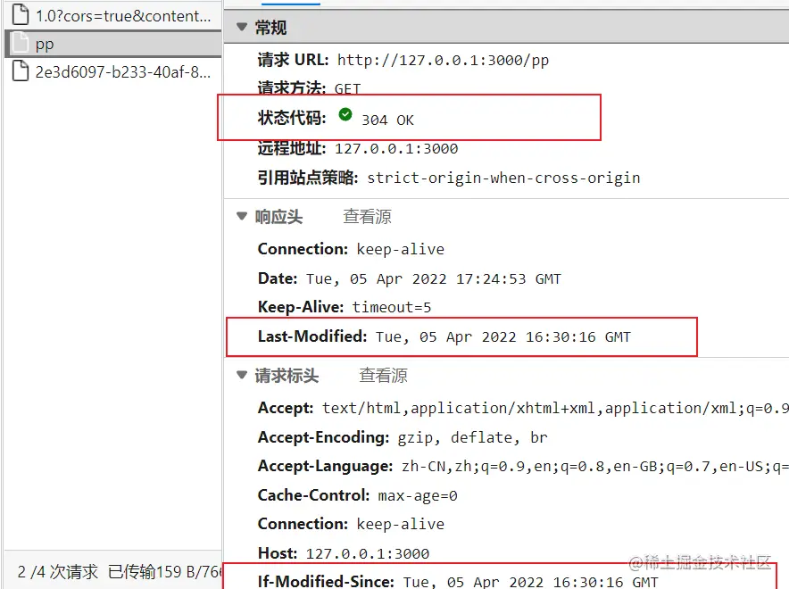

# [HTTP缓存](https://juejin.cn/post/7083178636852854792)

## 搭建环境

- 创建文件夹`app`，并在下创建`app.js` 和 `fs/a.txt`（里面随便写东西）


- 我们使用`node+koa2`来搭建我们需要的环境，安装koa、安装路由

```js
npm install koa --save
npm install koa-router --save
```

- app.js

```js
var Koa = require('koa');
var app = new Koa();
var Router = require('koa-router')();
const fs = require('fs')
Router.get("/", async (ctx) => {
    ctx.body = "ok"
})
app
    .use(Router.routes())   	//启动路由
    .use(Router.allowedMethods());
app.listen(3000);
```

启动服务器，网页输入网址`127.0.0.1:3000`，环境搭建成功


### 强缓存

强缓存时利用http头中的`Expires`和`Cache-Control`两个字段控制的，`Expires`是`http1.0`得规范，`Cache-Control`是`http1.1`中出现的，这里使用`Cache-Control`示范：

`Cache-Control`的一些常设置的值：

- `private`: 仅浏览器可以缓存（默认）
- `public`: 浏览器和代理服务器都可以缓存
- `max-age=xxx`: 过期时间单位秒
- `no-cache`: 不进行强缓存
- `no-store`: 不强缓存，也不协商缓存

将上面` / `路由的代码改为

```js
Router.get('/', async (ctx) => {
    const getResource = () => {
        return new Promise((res) => {
            fs.readFile("./fs/a.txt", (err, data) => {
                if (err) {
                    return;
                }
                res(data)
            })
        })
    }
    ctx.set('Cache-Control', 'max-age=10')  //设置强缓存，过期时间为10秒
    ctx.body = await getResource(); 
})
```

将测试搭建环境页面关闭，重新打开网页访问`127.0.0.1:3000`

前端页面响应头多了`Cache-Control`这个字段，且`10s`内都走本地缓存，不会去请求服务端


在过期时间内再次请求资源，就可以看到这次请求并没有经过服务器


### 协商缓存

主要涉及到两组：`ETag`和`If-None-Match`、`Last-Modified`和`if-Modified-Since`

#### `ETag`和`If-None-Match`

`ETag/If-None-Match`返回的是一个校验码。ETag可以保证每一个资源是唯一的，资源变化都会导致ETag变化。服务器根据浏览器发送的`If-None-Match`值来判断是否命中。当浏览器返回`304 not modified`的响应时，**由于ETag重新生成过，`response header`还会把这个ETag返回，即使这个Etag和之前的没有变化**

#### `Last-Modified`和`if-Modified-Since`

浏览器第一次请求一个资源的时候，服务器返回的header会加上`Last-Modified`，**Last-Modified是一个时间标识该资源的最后修改时间**，例如`Last-Modify: Thu,31 Dec 2037 23:59:59 GMT`。

当浏览器再次请求该资源时，request的请求头中会包含`if-Modified-Since`，该值为缓存之前返回的`Last-modified`。服务器收到`if-Modified-Since`后，根据资源的最后修改时间判断是否命中。

如果命中缓存，则返回304，**并且不会返回该资源以及Last-Modified**

示例我们通过`Last-Modified`和`if-Modified-Since`实现。**对于ETag和If-None-Match的实现，读取资源内容，转成hash值，然后和Last-modified和if-Modified-Since差不多**

新添加一个路由器

```js
Router.get('/pp', async (ctx) => {
    const ifModifiedSince = ctx.request.header['if-modified-since'];
    const getResource = () => {
        return new Promise((res) => {
            fs.stat("./fs/a.txt", (err, stats) => {
                if (err) {
                    console.log(err);
                }
                res(stats)
            })
        })
    }
    let resource = await getResource();
    // atime	Access Time	访问时间	
    // 最后一次访问文件（读取或执行）的时间
    // ctime	Change Time	变化时间	
    // 最后一次改变文件（属性或权限）或者目录（属性或权限）的时间
    // mtime	Modify Time	修改时间	
    // 最后一次修改文件（内容）或者目录（内容）的时间
    if (ifModifiedSince === resource.mtime.toGMTString()) { //把具体的日期转换为（根据 GMT）字符串
        ctx.status = 304;
    }
    ctx.set('Last-Modified', resource.mtime.toGMTString());
    ctx.body = resource
})

```

```JSON
//对于resource返回
{
  "dev": 16777233,
  "mode": 33188,
  "nlink": 1,
  "uid": 501,
  "gid": 20,
  "rdev": 0,
  "blksize": 4096,
  "ino": 96021001,
  "size": 4,
  "blocks": 8,
  "atimeMs": 1705054383095.8315,
  "mtimeMs": 1705054381784.9543,
  "ctimeMs": 1705054381784.9543,
  "birthtimeMs": 1705044336332.4282,
  "atime": "2024-01-12T10:13:03.096Z",
  "mtime": "2024-01-12T10:13:01.785Z",
  "ctime": "2024-01-12T10:13:01.785Z",
  "birthtime": "2024-01-12T07:25:36.332Z"
}
```

关闭页面，重新打开网页访问`127.0.0.1:3000/pp`

第一次请求，是没有`if-modified-since`字段的


第二次请求，没有修改资源，返回状态码304，从缓存获取资源



修改a.txt文件里内容时，重新请求服务器


