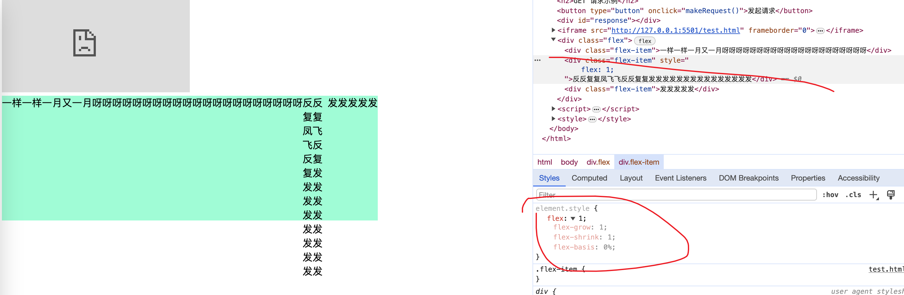
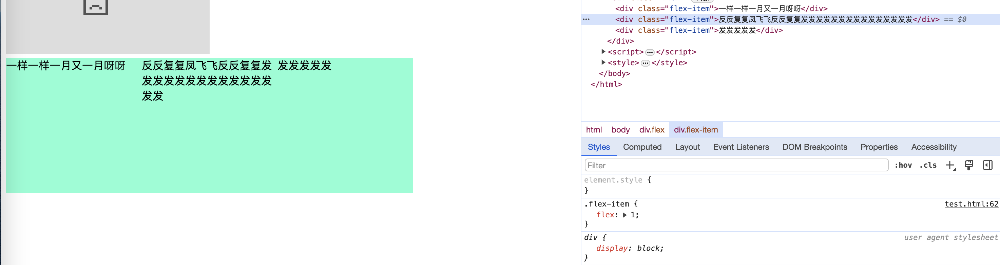
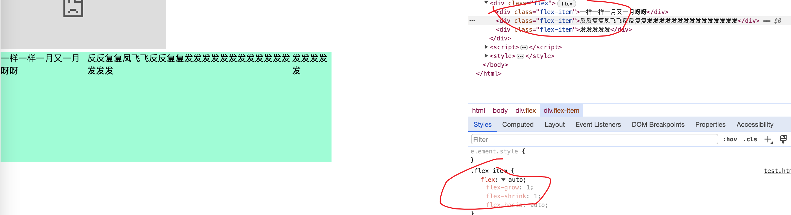
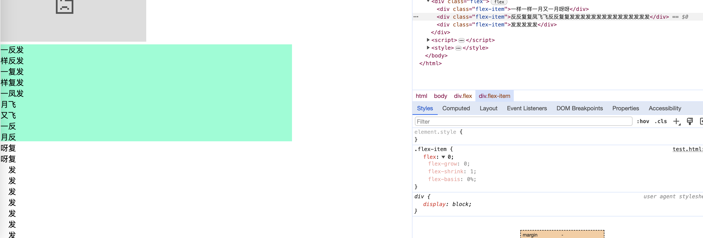
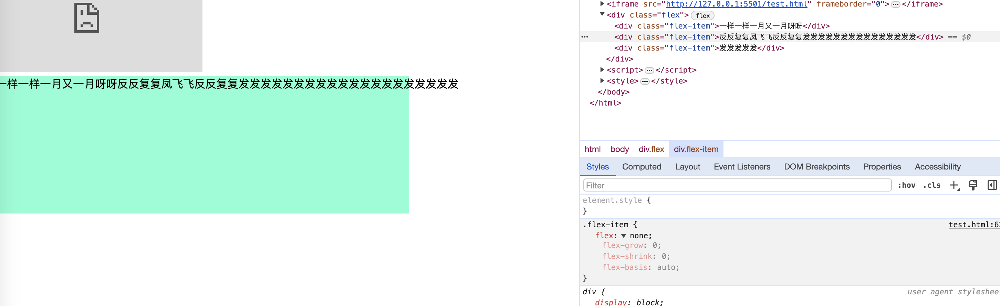

## [flex](https://juejin.cn/post/6967177565458923557)

`flex`:flex属性是flex-grow, flex-shrink 和 flex-basis的简写，默认值为0 1 auto。后两个属性可选。

### flex:1

 在父元素尺寸不足的时候，会优先最小化内容尺寸。
    
    - 当我们希望元素可以充分的利用剩余的空间，同时不会很多的占用其他同级元素的空间的时候使用。
    
    - 使用场景：等分布局、等比例列表
### flex:auto

从例子我们可以看出 flex:auto ，在充分分配容器尺寸的前提下，会优先扩展自己,填充父容器的尺寸

    - 当我们希望元素充分的使用剩余的空间，各自元素按照各自内容进行分配的时候使用
    - 使用场景：内容动态适配布局、自适应布局、子元素个数不确定时
    
### flex: 0

元素的内容宽度最小化，并没有充分的分配容器的尺寸。

    
### flex:none

表示元素的大小由内容决定，但是flex-grow，flex-shrink都是0，元素没有弹性，通常表现为内容最大化宽度
    
      从以上的例子可以看出:flex:none的时候元素的内容直接溢出容器，没有换行，表现为最大内容宽度
    - 适用场景： 元素的宽度就是内容的宽度，并且内容永远不会换行按钮里面文字不换行处理

### 总结

- flex:1 & flex:auto 的区别主要体现在 =>在充分分配父元素宽度的情况下，子元素是`优先扩展（auto）自己的尺寸还是优先减小（1）自己的尺寸`
- flex:0 & flex: none 的区别主要体现在 =>不考略父元素宽度的情况下，`最大化内容宽度（none）还是最小化内容宽度（0）`
- 对于不同的使用场景，我们应该使用不同的flex。比如flex：1多用于等分布局中，flex：auto多用于内容动态适配中，flex：none多用于元素内容最大化处理