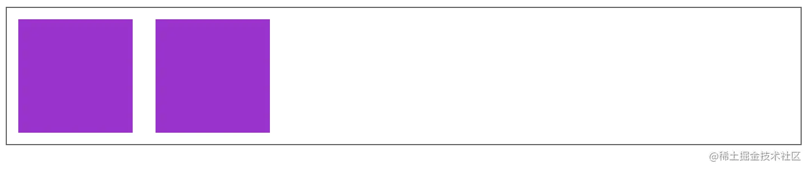
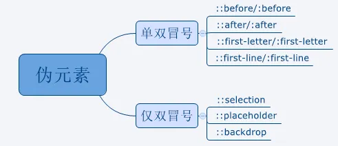

# Html5和CSS3

## 1. 常见的水平垂直居中实现方案

- 最简单的方案当然是flex布局
```css
.father {
    display: flex;
    justify-content: center;
    align-items: center;
}
.son {
   ...
}
```
- 绝对定位配合margin:auto,的实现方案
```css
.father {
    position: relative;
}
.son {
    position: absolute;
    top: 0;
    left: 0;
    bottom: 0;
    right: 0;
    margin: auto;
}
```
- absolute+负margin
```css
.father {
	position: relative;
	width: 300px;
	height: 300px;
	border: 3px solid red;
  }
  .son {
	position: absolute;
	width: 100px;
	height: 100px;
	background-color: aqua;
	top: 50%;
	left: 50%;
	/* 负margin须是高度或宽度的一半 */
	margin-top: -50px;
	margin-left: -50px;
  }
```
- absolute+calc(css3计算属性)
- absolute+transform
- 绝对定位配合transform实现
```css
.father {
    position: relative;
}
.son {
    position: absolute;
    top: 50%;
    left: 50%;
    transform: translate(-50%, -50%);
}
```
- Grid 方案
```css
.outer {
  display: grid;
}

.inner {
  justify-self: center; /* 水平居中 */
  align-self: center; /* 垂直居中 */
}
```
- 父元素display:table-cell;vertical-align:middle。里面的子元素就会实现水平垂直居中，不需要知道子元素的宽高
```css
/* HTML */
<div class='father'>
  <div class='son'></div>
</div>
<style>
  .father {
	display: table-cell;
	vertical-align: middle;
	text-align: center;
	width: 300px;
	height: 300px;
	border: 3px solid red;
  }
  .son {
	width: 100px;
	height: 100px;
	background-color: aqua;
	display: inline-block;
  }
</style>
```
- line-height
父元素：line-height=height，text-align:center。子元素：display:inline-block,vertical-align: middle。子元素水平垂直居中，`不需要知道子元素的宽高`
```css
<!-- HTMl -->
<div class="father">
	<div class="son"></div>
</div>
<style>
  .father {
	width: 300px;
	height: 300px;
	border: 3px solid red;
	line-height: 300px;
	text-align: center;
  }
  .son {
	background-color: aqua;
	width: 100px;
	height: 100px;
	display: inline-block;
	vertical-align: middle;
  }
</style>
```
- writing-mode
```css
<div class="grandfather">
  <div class="father">
	<div class="son"></div>
  </div>
</div>
<style>
  .grandfather {
	width: 300px;
	height: 300px;
	border: 3px solid red;
	writing-mode: vertical-lr;
	text-align: center;
  }
  .father {
	writing-mode: horizontal-tb;
	display: inline-block;
	width: 100%;
  }
  .son {
	background-color: blue;
	width: 100px;
	height: 100px;
	display: inline-block;
  }
</style>
```
## 2. BFC问题

> `BFC（Block Formatting Context）`，即块级格式化上下文，BFC目的是形成一个相对于外界完全独立的空间，让内部的子元素不会影响到外部的元素。

BFC形成条件:
- 根元素，即`HTML`元素
- 浮动元素：`float`值为`left`、`right`
- `overflow`值不为 `visible`，为 `auto`、`scroll`、`hidden`
- `display`的值为`inline-block`、`inltable-cell`、`table-caption`、`table`、`inline-table`、`flex`、`inline-flex`、`grid`、`inline-grid`
- `position`的值为`absolute`或`fixed`

BFC渲染规则：
- 内部的盒子会在垂直方向上一个接一个的放置
- 对于同一个BFC的俩个相邻的盒子的margin会发生重叠，与方向无关。
- 每个元素的左外边距与包含块的左边界相接触（从左到右），即使浮动元素也是如此
- BFC的区域不会与float的元素区域重叠
- 计算BFC的高度时，浮动子元素也参与计算
- BFC就是页面上的一个隔离的独立容器，容器里面的子元素不会影响到外面的元素，反之亦然

### 应用场景

- 防止margin重叠（塌陷）
    对于同一个BFC的两个相邻的盒子margin会发生重叠，大小是最大的margin 以下这段代码中的两个p元素同属于一个BFC，之间的margin是100px

    

    防止margin重叠，就要将其置于两个BFC中，可以这样解决：

    

- 清除内部浮动

    

    效果图如下（可以看到因为浮动，.box的高度不包含.fl的高度，高度为0）：

    

    我们可以将.box触发为BFC,计算高度时，浮动元素也会参与计算, 给.box添加overflow:hidden属性：

    

    最后效果如下：

    

- 自适应多栏布局 这里举个两栏的布局

    

    前面讲到，每个元素的左外边距与包含块的左边界相接触。因此，虽然.aslide为浮动元素，但是main的左边依然会与包含块的左边相接触

    而BFC的区域不会与浮动盒子重叠

    所以我们可以通过触发main生成BFC，以此适应两栏布局

    

    效果如下：

    

## 清除浮动方法及原理

为什么要清除浮动：父元素因为子级元素浮动引起的内部高度为0的问题。

清除浮动常用的四种方式：

- 父级div定义height
- 额外标签法：在有浮动的父级元素的末尾插入了一个没有内容的块级元素div 并添加样式clear:both。
- 利用伪元素：父级div定义 伪类:after，我们可以写一个.clearfix 工具样式，当需要清除浮动时，就为其加上这个类 .clearfix:after { display: block; clear :both; content: '';}。
- 父级添加overflow属性：包含浮动元素的父标签添加样式overflow为hidden或auto，通过触发BFC方式，实现清除浮动

## CSS 中的 vertical-align 有哪些值？它在什么情况下才能生效？

vertical-align属性值：
- 线类：baseline、top、middle、bottom
- 文本类：text-top、text-bottom
- 上标下标类：sub、super
- 数值百分比类：20px、2em、20%等（对于基线往上或往下偏移）

> 负值相对于基线往下偏移，正值往上偏移，事实上vertical-align:base-line等同于vertical-align:0。这个负值真的是 CSS 神器！

vertical-align生效前提：
- 内联元素span、strong、em、img、button、input等
- display值为inline、inline-block、inline-table或table-cell的元素
- 需要注意浮动和绝对定位会让元素块状化，因此此元素绝对不会生效

## 淘宝商品添加到购物车的动画

贝塞尔曲线

## 3. flex:1; 是哪些属性的缩写，对应的属性代表什么含义

`flex: 1`;在浏览器中查看分别是`flex-grow`（设置了对应元素的增长系数）、`flex-shrink`(指定了对应元素的收缩规则，只有在所有元素的默认宽度之和大于容器宽度时才会触发)、`flex-basis`（指定了对应元素在主轴上的大小）


## 说一下flex

是网页布局（layout）是 CSS 样式应用。布局的传统解决方案，基于盒状模型，依赖 display 属性 + position属性 + float属性。它对于那些特殊布局非常不方便，比如，垂直居中就不容易实现，用的css代码行数就多了。2009年，W3C 提出了一种新的方案----Flex 布局，可以简便又响应式地实现各种页面布局。目前，它已经得到了所有浏览器的支持，这意味着，现在就能很安全地使用这项功能。

Flex 是 Flexible Box 的缩写，意为"弹性布局"，任何一个容器都可以指定为 Flex 布局。Webkit 内核的浏览器，必须加上-webkit前缀。

> 注意，设为 Flex 布局以后，子元素的`float`、`clear`和`vertical-align`属性将失效。

采用 Flex 布局的元素，称为 Flex 容器（flex container），简称"容器"。它的所有子元素自动成为容器成员，称为 Flex 项目（`flex item`），简称"项目"。

容器默认存在两根轴：`水平的主轴`（main axis）和`垂直的交叉轴`（cross axis）。主轴的开始位置（与边框的交叉点）叫做main start，结束位置叫做main end；交叉轴的开始位置叫做cross start，结束位置叫做cross end。

项目默认沿主轴排列。单个项目占据的主轴空间叫做main size，占据的交叉轴空间叫做cross size。

以下6个属性设置在容器上。

- `flex-direction`: 属性决定主轴的方向（即项目的排列方向）。`column`、`column-reverse`、`row`、`row-reverse`
- `flex-wrap`: 默认情况下，项目都排在一条线（又称"轴线"）上。flex-wrap属性定义，如果一条轴线排不下，如何换行。nowrap、wrap、reverse-wrap
- `flex-flow`: 默认值为row nowrap。简写形式：flex-direction、flex-wrap
- `justify-content`: 属性定义了项目在主轴上的对齐方式。flex-start、flex-end、center、space-between、space-around
- `align-items`: 属性定义项目在交叉轴上如何对齐。flex-start、flex-end、center、baseline、stretch
- `align-content`: 属性定义了多根轴线的对齐方式。如果项目只有一根轴线，该属性不起作用。flex-start、flex-end、center、space-between、space-around、stretch

以下6个属性设置在项目上。

- `order`：属性定义项目的排列顺序。数值越小，排列越靠前，默认为0。
  ```CSS
  .item {
      order: <integer>;
    }
  ```
- `flex-grow`:属性定义项目的放大比例，默认为0，按比例计算占据空间。默认为0
- `flex-shrink`：属性定义了项目的缩小比例。默认1
- `flex-basis`
- [`flex`](/flex):flex属性是flex-grow, flex-shrink 和 flex-basis的简写，默认值为0 1 auto。后两个属性可选。
  - flex:1
  - flex:auto
  - flex: 0
  - flex:none
- `align-self`: 属性允许单个项目有与其他项目不一样的对齐方式，可覆盖align-items属性。默认值为auto，表示继承父元素的align-items属性，如果没有父元素，则等同于stretch。auto | flex-start | flex-end | center | baseline | stretch;

## 伪类和伪元素

### 为什么引入?
  css引入伪类和伪元素概念是为了格式化文档树以外的信息。伪类和伪元素是用来`修饰不在文档树中的部分`。
### 伪类
  伪类 用于当元素处于某个状态时，为其添加对应的样式，这个状态是根据用户行为而动态变化的。比如说，用户悬停在指定的元素时，我们可以通:hover来描述这个元素的状态。虽然它和普通的css类类似，可以为已有的元素添加样式，但是它只有处于dom树无法描述的状态下才能为元素添加样式，所以将其称为伪类。
  
### 伪元素
  用于创建不在文档树中的元素，并为其添加样式，比如说，我们可以通过：before来在一个元素前添加一些文本，并为这些文本添加样式。虽然用户可以看到这些文本，但是这些文本实际上不在文档树中。
  
  >CSS3 规范中的要求使用双冒号 (::) 表示伪元素，以此来区分伪元素和伪类，比如::before 和::after 等伪元素使用双冒号 (::)，:hover 和:active 等伪类使用单冒号 (:)。虽然 CSS3 标准要求伪元素使用双冒号的写法，但也依然支持单冒号的写法。

## 实现固定宽高比(width: height = 4: 3 )的div，怎么设置

利用css中 padding百分比的计算方法：padding设置为百分比，是以元素的宽度乘以100%从而得到的padding值的。

在div的width为固定的情况下，设置height为0，使内容自然溢出，再通过设置padding-bottom使元素有一定高度。
```css
    width: 100%;
    height: 0;
    padding-top: 50%;
    background: red;
```
利用将padding-top或padding-bottom设置成百分比，来实现高度满足宽度的某个比例。因为，当margin/padding取形式为百分比的值时，无论是left/right，还是top/bottom，都是以父元素的width为参照物的！

## CSS选择器

- 通用选择器(*)
- 标签选择器（div）
- class选择器(.wrap)
- id选择器（#wrap）
- 属性选择器(E[att], E[att=val], E[att~=val])
  - E[att]：匹配所有具有att属性的E元素，不考虑它的值
  - E[att=val]：匹配所有att属性等于"val"的E元素
  - E[att~=val]：匹配所有att属性具有多个空格分隔的值、其中一个值等于"val"的E元素
- 相邻选择器(h1 + p)
- 子选择器（ul > li）：只匹配一个元素的直接子元素
- 后代选择器（li a）：所有后代匹配的子元素
- 伪类选择器
  - E:first-child：匹配父元素的第一个子元素
  - E:link 匹配所有未被点击的链接
  - E:focus 匹配获得当前焦点的E元素
  - E:not(s) 反选伪类，匹配不符合当前选择器的任何元素

选择器的优先级（就近原则）：!important > [ id > class > tag ]

## display: none和 visibility:hidden的区别

- 是否占据空间: display: none 不占据空间;visibility:hidden 占据空间
- 是否渲染: display:none，会触发reflow（回流），进行渲染。visibility:hidden，只会触发repaint（重绘），因为没有发现位置变化，不进行渲染。
- 是否是继承属性(株连性): display:none，display不是继承属性，元素及其子元素都会消失。visibility:hidden，visibility是继承属性，若子元素使用了visibility:visible，则不继承，这个子孙元素又会显现出来。

## em rem vh vw calc(), line-height 百分比

- em: 

em: 相对单位，参考物是元素的font-size，具有继承的特点。如果字体大小是16px（浏览器的默认值），那么 1em = 16px

- rem

rem：相对单位，可理解为”root em”, 相对根节点html的字体大小来计算，不会像em那样，依赖于父元素的字体大小，而造成混乱
  - 实现原理及相应的计算方案
      rem布局的本质是等比缩放，一般是基于宽度.
      需要了解的基础知识：
      1. 默认浏览器设置的字体大小为16px
      2. viewport属性 width、height、initial-scale、maximum-scale、minimum-scale、user-scalable这些属性，分别表示宽度、高度、初始缩放比例、最大缩放比例、最小缩放比例、是否允许用户缩放
      ```HTML
      <meta name="viewport" content="width=device-width, initial-scale=1, maximum-scale=1, minimum-scale=1.0, user-scalable=no">
      ```
      3. dpr, dpr是设备像素比，是css里面1px所能显示的像素点的个数，dpr的值越大，显示的越精细;window.devicePixelRatio获取到当前设备的dpr。
  - rem实现适配的原理
    - 核心思想：百分比布局可实现响应式布局，而rem相当于百分比布局。
    - 实现原理：动态获取当前视口宽度width，除以一个固定的数n，得到rem的值。表达式为rem = width / n。
    - 通过此方法，rem大小始终为width的n等分。
  - 计算方案：
    - 通过dpr设置缩放比，实现布局视口大小
    ```JS
    var scale = 1 / devicePixelRatio;  
    document.querySelector('meta[name="viewport"]').setAttribute('content','initial-scale='+ scale + ', maximum-scale=' + scale + ', minimum-scale=' + scale + ', user-scalable=no');
    ```
    - 动态计算html的font-size
    ```JS
    // 设置根元素字体大小。此时为宽的100等分
    document.documentElement.style.fontSize = ocument.documentElement.clientWidth / 100 + 'px';
    ```
### 单位换算库

  实际开发过程中，可以使用 `lib-flexible`[8]库，但是如果每次写的时候都要手动去计算有点太过麻烦了，我们可以通过在webpack中配置 `px2rem-loader`[9], 或者 `pxrem-loader`[10]，主要原理就是需要自己配置 px转rem的计算规则，在编辑的时候直接计算转成rem。所以在开发的时候直接按照设计稿的尺寸写px，编译后会直接转化成rem；
  - [lib-flexible](https://github.com/amfe/article/issues/17): 计算公式 (设计稿元素宽度/设计稿宽度)*10
  - 设置[viewport](http://www.cnblogs.com/azhai-biubiubiu/p/5305022.html)配合进行缩放,通常在写移动端页面的时候，我们都会设置         viewport，保证页面缩放没有问题，最常见的viewport的meta标签如下：
  ```html
    <meta name="viewport" content="width=device-width, initial-scale=1.0, maximum-scale=1.0, user-scalable=no" />
  ```
  至于为什么要加入viewport，我觉得就是因为现在市面上虽然有那么多不同种类不同品牌不同分辨率的手机，但它们的理想viewport宽度归纳起来无非也就 320、360、414、等几种，都是非常接近的，理想宽度的相近也就意味着我们针对某个设备的理想viewport而做出的网站，在其他设备上的表现也不会相差非常多甚至是表现一样的。

# 性能优化题

## 什么情况下会重绘和回流，常见的改善方案

浏览器请求到对应页面资源的时候，会将`HTML解析成DOM`，把`CSS解析成CSSDOM`，然后将DOM和CSSDOM合并就产生了`Render Tree`。在有了渲染树之后，浏览器会根据流式布局模型来计算它们在页面上的`大小和位置`，最后将`节点绘制`在页面上。

那么当`Render Tree`中部分或全部元素的`尺寸、结构、或某些属性`发生改变，浏览器就会`重新渲染页面`，这个就是浏览器的`回流`。常见的回流操作有：`页面的首次渲染`、`浏览器窗口尺寸改变`、`部分元素尺寸或位置变化`、`添加或删除可见的DOM`、`激活伪类`、`查询某些属性或调用方法`（各种`宽高的获取`，`滚动方法的执行`等）。

当页面中的`元素样式的改变不影响它在文档流的位置`时（如`color`、`background-color`等），浏览器对应元素的样式，这个就是`重绘`。

可见：`回流必将导致重绘，重绘不一定会引起回流。回流比重绘的代价更高`。

常见改善方案：

- 在进行频繁操作的时候，使用防抖和节流来控制调用频率。
- 避免频繁操作`DOM`，可以利用`DocumentFragment`，来进行对应的DOM操作，将最后的结果添加到文档中。
- 灵活使用`display: none`属性，操作结束后将其显示出来，因为`display`的属性为`none`的元素上进行的DOM操作不会引发`回流和重绘`。
- 获取各种会引起`重绘/回流`的属性，尽量将其`缓存`起来，不要频繁的去获取。
- 对`复杂动画采用绝对定位`，使其脱离文档流，否则它会频繁的引起父元素及其后续元素的回流。

## 一次请求大量数据怎么优化，数据多导致渲染慢怎么优化

个人觉得这就是个伪命题，首先后端就不该一次把大量数据返回前端，但是会这么问，那么我们作为面试的就老老实实回答呗。

首先大量数据的接收，那么肯定是用`异步的方式进行接收`，对数据进行一个`分片处理`，可以拆分成一个个的小单元数据，通过自定义的属性进行关联。这样数据分片完成。接下来渲染的话，由于是大量数据，如果是长列表的话，这里就可以使用`虚拟列表`（当前页面需要渲染的数据拿到进行渲染，然后对前面一段范围及后面一段范围，监听对应的`滚动数据来切换需要渲染的数据`，这样始终要渲染的就是三部分）。当然还有别的渲染情况，比如echarts图标大量点位数据优化等。

## SVG与Canvas比较

- svg 是一种矢量图，而 canvas 依赖于分辨率。所以 svg 放大不会失真，但是 canvas 绘制的图形会失真。
- svg 支持事件处理器，而 canvas 不支持事件处理器。
- svg 中的文字独立于图像，文字可保留，可编辑和可搜索，canvas 的文本渲染能力弱。
- canvas 适合图像密集型的游戏，频繁地重绘图像，svg 绘制的复杂度高时减慢渲染的速度。
- canvas 绘制的图形可以多种格式 (jpg、png) 保存图片，但是 svg 绘制的只能以 .svg 格式保存，使用时可以引入 html 文件。
- canvas 适合开发游戏，svg 不适合游戏应用。

