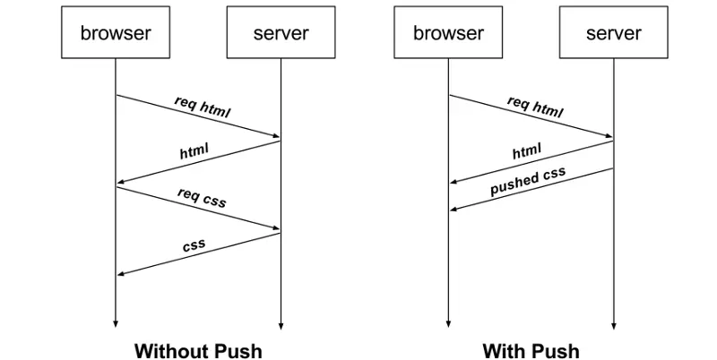

# HTTP2牛逼在哪儿

## HTTP2性能优化方面

我们得先要了解下 HTTP/1.1 协议存在的性能问题，因为 HTTP/2 协议就是把这些性能问题逐个攻破了。

现在的站点相比以前变化太多了，比如：

- `消息的大小变大了`，从几 KB 大小的消息，到几 MB 大小的消息；
- `页面资源变多了`，从每个页面不到 10 个的资源，到每页超 100 多个资源；
- `内容形式变多样了`，从单纯到文本内容，到图片、视频、音频等内容；
- `实时性要求变高了`，对页面的实时性要求的应用越来越多；

这些变化带来的最大性能问题就是 HTTP/1.1 的高延迟，延迟高必然影响的就是用户体验。主要原因如下几个：

- `延迟难以下降`，虽然现在网络的「带宽」相比以前变多了，但是延迟降到一定幅度后，就很难再下降了，说白了就是到达了延迟的下限；
- `并发连接有限`，谷歌浏览器最大并发连接数是 6 个，而且每一个连接都要经过 TCP 和 TLS 握手耗时，以及 TCP 慢启动过程给流量带来的影响；
- `队头阻塞问题`，同一连接只能在完成一个 HTTP 事务（请求和响应）后，才能处理下一个事务；
- `HTTP 头部巨大且重复`，由于 HTTP 协议是无状态的，每一个请求都得携带 HTTP 头部，特别是对于有携带 Cookie 的头部，而 Cookie 的大小通常很大；
- `不支持服务器推送消息`，因此当客户端需要获取通知时，只能通过定时器不断地拉取消息，这无疑浪费大量了带宽和服务器资源。

为了解决 HTTP/1.1 性能问题，具体的优化手段你可以看这篇文章「HTTP/1.1 如何优化？ (opens new window)」，这里我举例几个常见的优化手段：

- 将多张小图合并成一张大图供浏览器 JavaScript 来切割使用，这样可以将多个请求合并成一个请求，但是带来了新的问题，当某张小图片更新了，那么需要重新请求大图片，浪费了大量的网络带宽；
- 将图片的二进制数据通过 Base64 编码后，把编码数据嵌入到 HTML 或 CSS 文件中，以此来减少网络请求次数；
- 将多个体积较小的 JavaScript 文件使用 Webpack 等工具打包成一个体积更大的 JavaScript 文件，以一个请求替代了很多个请求，但是带来的问题，当某个 js 文件变化了，需要重新请求同一个包里的所有 js 文件；
- 将同一个页面的资源分散到不同域名，提升并发连接上限，因为浏览器通常对同一域名的 HTTP 连接最大只能是 6 个；

尽管对 HTTP/1.1 协议的优化手段如此之多，但是效果还是不尽人意，因为这些手段都是对 HTTP/1.1 协议的“外部”做优化，`而一些关键的地方是没办法优化的，比如请求-响应模型、头部巨大且重复、并发连接耗时、服务器不能主动推送等，要改变这些必须重新设计 HTTP 协议，于是 HTTP/2 就出来了！`

## 兼容 HTTP/1.1

HTTP/2 出来的目的是为了改善 HTTP 的性能。协议升级有一个很重要的地方，就是要兼容老版本的协议，否则新协议推广起来就相当困难，所幸 HTTP/2 做到了兼容 HTTP/1.1。

那么，HTTP/2 是怎么做的呢？

第一点，HTTP/2 没有在 URI 里引入新的协议名，仍然用「http://」表示明文协议，用「https://」表示加密协议，于是只需要浏览器和服务器在背后自动升级协议，这样可以让用户意识不到协议的升级，很好的实现了协议的平滑升级。

第二点，只在应用层做了改变，还是基于 TCP 协议传输，应用层方面为了保持功能上的兼容，HTTP/2 把 HTTP 分解成了「语义」和「语法」两个部分，「语义」层不做改动，与 HTTP/1.1 完全一致，比如请求方法、状态码、头字段等规则保留不变。

但是，HTTP/2 在「语法」层面做了很多改造，基本改变了 HTTP 报文的传输格式。

## 头部压缩

HTTP 协议的报文是由「Header + Body」构成的，对于 Body 部分，HTTP/1.1 协议可以使用头字段 「Content-Encoding」指定 Body 的压缩方式，比如用 gzip 压缩，这样可以节约带宽，但报文中的另外一部分 Header，是没有针对它的优化手段。

HTTP/1.1 报文中 Header 部分存在的问题：

- 含很多固定的字段，比如 Cookie、User Agent、Accept 等，这些字段加起来也高达几百字节甚至上千字节，所以有必要`压缩`；
- 大量的请求和响应的报文里有很多字段值都是重复的，这样会使得大量带宽被这些冗余的数据占用了，所以有必须要`避免重复性`；
- 字段是 ASCII 编码的，虽然易于人类观察，但效率低，所以有必要改成`二进制编码`；

HTTP/2 对 Header 部分做了大改造，把以上的问题都解决了。

HTTP/2 没使用常见的 gzip 压缩方式来压缩头部，而是开发了 `HPACK` 算法，`HPACK` 算法主要包含三个组成部分：

- 静态字典；
- 动态字典；
- Huffman 编码（压缩算法）；

客户端和服务器两端都会建立和维护`「字典」`，用长度较小的索引号表示重复的字符串，再用 Huffman 编码压缩数据，`可达到 50%~90% 的高压缩率`。

## 二进制帧

HTTP/2 厉害的地方在于将 HTTP/1 的文本格式改成二进制格式传输数据，极大提高了 HTTP 传输效率，而且二进制数据使用位运算能高效解析。

## 并发传输

知道了 HTTP/2 的帧结构后，我们再来看看它是如何实现`并发传输`的。

我们都知道 HTTP/1.1 的实现是基于请求-响应模型的。同一个连接中，HTTP 完成一个事务（请求与响应），才能处理下一个事务，也就是说在发出请求等待响应的过程中，是没办法做其他事情的，如果响应迟迟不来，那么后续的请求是无法发送的，也造成了`队头阻塞`的问题。

而 HTTP/2 就很牛逼了，通过 Stream 这个设计，多个 Stream 复用一条 TCP 连接，达到并发的效果，解决了 HTTP/1.1 队头阻塞的问题，提高了 HTTP 传输的吞吐量。


你可以从上图中看到：

- 1 个 TCP 连接包含一个或者多个 Stream，Stream 是 HTTP/2 并发的关键技术；
- Stream 里可以包含 1 个或多个 Message，Message 对应 HTTP/1 中的请求或响应，由 HTTP 头部和包体构成；
- Message 里包含一条或者多个 Frame，Frame 是 HTTP/2 最小单位，以二进制压缩格式存放 HTTP/1 中的内容（头部和包体）；

因此，我们可以得出个结论：多个 Stream 跑在一条 TCP 连接，同一个 HTTP 请求与响应是跑在同一个 Stream 中，HTTP 消息可以由多个 Frame 构成， 一个 Frame 可以由多个 TCP 报文构成。

在 HTTP/2 连接上，`不同 Stream 的帧是可以乱序发送的（因此可以并发不同的 Stream ）`，因为每个帧的头部会携带 Stream ID 信息，所以接收端可以通过 Stream ID 有序组装成 HTTP 消息，`而同一 Stream 内部的帧必须是严格有序的`。

同一个连接中的 Stream ID 是不能复用的，只能顺序递增，所以当` Stream ID 耗尽`时，需要发一个控制帧 `GOAWAY`，用来`关闭 TCP 连接`。

在 Nginx 中，可以通过 `http2_max_concurrent_Streams` 配置来设置 `Stream` 的上限，默认是 `128` 个。

HTTP/2 通过 Stream 实现的并发，比 HTTP/1.1 通过 TCP 连接实现并发要牛逼的多，`因为当 HTTP/2 实现 100 个并发 Stream 时，只需要建立一次 TCP 连接，而 HTTP/1.1 需要建立 100 个 TCP 连接，每个 TCP 连接都要经过 TCP 握手、慢启动以及 TLS 握手过程，这些都是很耗时的。`

HTTP/2 还可以对每个 Stream 设置不同优先级，帧头中的「标志位」可以设置`优先级`，比如客户端访问 HTML/CSS 和图片资源时，希望服务器先传递 HTML/CSS，再传图片，那么就可以通过设置 Stream 的优先级来实现，以此提高用户体验。

## 服务器主动推送资源

HTTP/1.1 不支持服务器主动推送资源给客户端，都是由客户端向服务器发起请求后，才能获取到服务器响应的资源。

比如，客户端通过 HTTP/1.1 请求从服务器那获取到了 HTML 文件，而 HTML 可能还需要依赖 CSS 来渲染页面，这时客户端还要再发起获取 CSS 文件的请求，需要两次消息往返，如下图左边部分：



如上图右边部分，在 HTTP/2 中，客户端在访问 HTML 时，服务器可以直接主动推送 CSS 文件，减少了消息传递的次数。

在 Nginx 中，如果你希望客户端访问 /test.html 时，服务器直接推送 /test.css，那么可以这么配置：
```nginx
location /test.html { 
  http2_push /test.css; 
}
```
那 HTTP/2 的推送是怎么实现的？

客户端发起的请求，必须使用的是奇数号 Stream，服务器主动的推送，使用的是偶数号 Stream。服务器在推送资源时，会通过 PUSH_PROMISE 帧传输 HTTP 头部，并通过帧中的 Promised Stream ID 字段告知客户端，接下来会在哪个偶数号 Stream 中发送包体。


如上图，在 Stream 1 中通知客户端 CSS 资源即将到来，然后在 Stream 2 中发送 CSS 资源，注意 Stream 1 和 2 是可以`并发`的。

## 总结

HTTP/2 协议其实还有很多内容，比如流控制、流状态、依赖关系等等。

这次主要介绍了关于 HTTP/2 是如何提升性能的几个方向，它相比 HTTP/1 大大提高了传输效率、吞吐能力。

第一点，对于常见的 HTTP 头部通过`静态表和 Huffman 编码`的方式，将体积压缩了近一半，而且针对后续的请求头部，还可以建立`动态表`，将体积压缩近 90%，大大提高了编码效率，同时节约了带宽资源。

不过，动态表并非可以无限增大， 因为动态表是会占用内存的，动态表越大，内存也越大，容易影响服务器总体的并发能力，因此服务器需要限制 HTTP/2 连接时长或者请求次数。

第二点，`HTTP/2 实现了 Stream 并发`，多个 Stream 只需复用 1 个 TCP 连接，节约了 TCP 和 TLS 握手时间，以及减少了 TCP 慢启动阶段对流量的影响。不同的 Stream ID 可以并发，即使乱序发送帧也没问题，比如发送 A 请求帧 1 -> B 请求帧 1 -> A 请求帧 2 -> B 请求帧2，但是同一个 Stream 里的帧必须严格有序。

另外，可以根据资源的渲染顺序来设置 Stream 的`优先级`，从而提高用户体验。

第三点，`服务器支持主动推送资源`，大大提升了消息的传输性能，服务器推送资源时，会先发送 PUSH_PROMISE 帧，告诉客户端接下来在哪个 Stream 发送资源，然后用偶数号 Stream 发送资源给客户端。

HTTP/2 通过 Stream 的并发能力，解决了 HTTP/1 队头阻塞的问题，看似很完美了，但是 HTTP/2 还是存在“队头阻塞”的问题，只不过问题不是在 HTTP 这一层面，而是在 TCP 这一层。

`HTTP/2 是基于 TCP 协议来传输数据的，TCP 是字节流协议，TCP 层必须保证收到的字节数据是完整且连续的，这样内核才会将缓冲区里的数据返回给 HTTP 应用，那么当「前 1 个字节数据」没有到达时，后收到的字节数据只能存放在内核缓冲区里，只有等到这 1 个字节数据到达时，HTTP/2 应用层才能从内核中拿到数据，这就是 HTTP/2 队头阻塞问题。`

有没有什么解决方案呢？既然是 TCP 协议自身的问题，那干脆放弃 TCP 协议，转而使用 UDP 协议作为传输层协议，这个大胆的决定，HTTP/3 协议做了！

# GET和POST

### GET 和 POST 有什么区别？

根据 RFC 规范，GET 的语义是从服务器`获取指定的资源`，这个资源可以是静态的文本、页面、图片视频等。GET `请求的参数位置一般是写在 URL 中`，URL 规定只能支持 ASCII，所以 GET 请求的参数只允许 ASCII 字符 ，而且`浏览器会对 URL 的长度有限制`（HTTP协议本身对 URL长度并没有做任何规定）。

根据 RFC 规范，POST 的语义是`根据请求负荷（报文body）对指定的资源做出处理`，具体的处理方式视资源类型而不同。POST 请求携带数据的位置一般是写在报文 body 中，`body 中的数据可以是任意格式的数据`，只要客户端与服务端协商好即可，而且`浏览器不会对 body 大小做限制`。

### GET 和 POST 方法都是安全和幂等的吗？

先说明下安全和幂等的概念：

- 在 HTTP 协议里，所谓的「安全」是指请求方法不会「破坏」服务器上的资源。
- 所谓的「幂等」，意思是多次执行相同的操作，结果都是「相同」的。

如果从 RFC 规范定义的语义来看：

- GET 方法就是安全且幂等的，因为它是`「只读」`操作，无论操作多少次，服务器上的数据都是安全的，且每次的结果都是相同的。所以，可以对 `GET 请求的数据做缓存`，这个缓存可以做到浏览器本身上（彻底避免浏览器发请求），也可以做到代理上（如nginx），而且在`浏览器中 GET 请求可以保存为书签`
- POST 因为是「新增或提交数据」的操作，会修改服务器上的资源，所以是不安全的，且多次提交数据就会创建多个资源，所以不是幂等的。所以，浏览器一般`不会缓存 POST 请求`，也不能把 POST 请求保存为书签。

### 小结

GET 的语义是请求获取指定的资源。GET 方法是安全、幂等、可被缓存的。

POST 的语义是根据请求负荷（报文主体）对指定的资源做出处理，具体的处理方式视资源类型而不同。POST 不安全，不幂等，（大部分实现）不可缓存。

注意， 上面是从 RFC 规范定义的语义来分析的。

但是实际过程中，开发者不一定会按照 RFC 规范定义的语义来实现 GET 和 POST 方法。比如：

- 可以用 GET 方法实现新增或删除数据的请求，这样实现的 GET 方法自然就不是安全和幂等。
- 可以用 POST 方法实现查询数据的请求，这样实现的 POST 方法自然就是安全和幂等。

如果「安全」放入概念是指信息是否会被泄漏的话，虽然 POST 用 body 传输数据，而 GET 用 URL 传输，这样数据会在浏览器地址拦容易看到，但是并不能说 GET 不如 POST 安全的。

因为 HTTP 传输的内容都是明文的，虽然在浏览器地址拦看不到 POST 提交的 body 数据，但是只要抓个包就都能看到了。

所以，要避免传输过程中数据被窃取，就要使用 HTTPS 协议，这样所有 HTTP 的数据都会被加密传输。

> GET 请求可以带 body 吗？

RFC 规范并没有规定 GET 请求不能带 body 的。理论上，任何请求都可以带 body 的。只是因为 RFC 规范定义的 GET 请求是获取资源，所以根据这个语义不需要用到 body。

另外，URL 中的查询参数也不是 GET 所独有的，POST 请求的 URL 中也可以有参数的。

# 简单请求和非简单请求

对于简单请求, 只要同时满足以下两大条件:

- method：get、post、head，
- header: accept\accept-language\content-language\last-event-id
    - content-type(application/x-www-form-urlencoded、multipart/form-data、text/plain)）

跨域浏览器会直接发出cors，就是在头信息中增加origin，服务器根据这个值，决定是否同意这次请求，也就是通过access-control-allow-irigin这个范围是否包含origin。

非简单请求

- method：put、delete
- content-type：application-json

在非简单请求通信前，浏览器会发送一个预检请求。询问服务器当前网页所在域名是否在服务器的许可名单之内，以及可以使用哪些header头信息，只有得到肯定答复，浏览器才会发送xmlhttprequest请求。

预检的请求方法是option，表示用来询问的，头信息关键字段是origin，除了这个还包括access-control-allow-method、access-control-allow-headers；再检查了这些字段以后，确认允许跨域，就可以正常通信了

# HTTPS是如何建立的？期间交互了什么？


