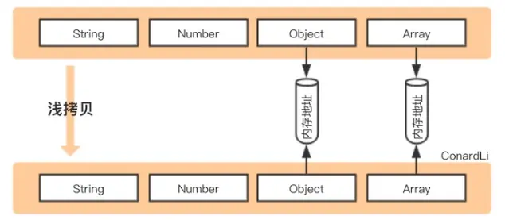
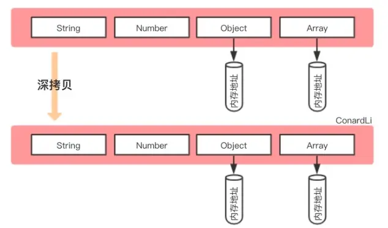
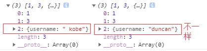
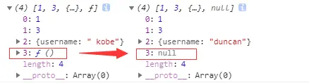
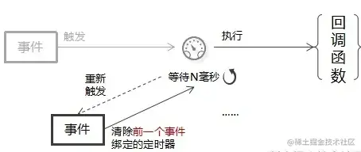
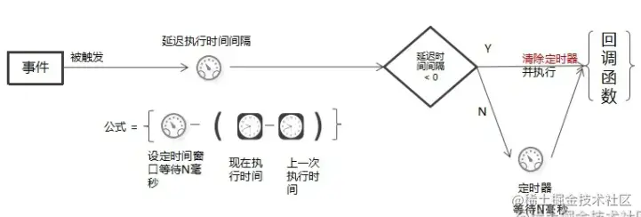
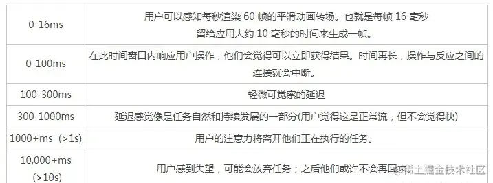
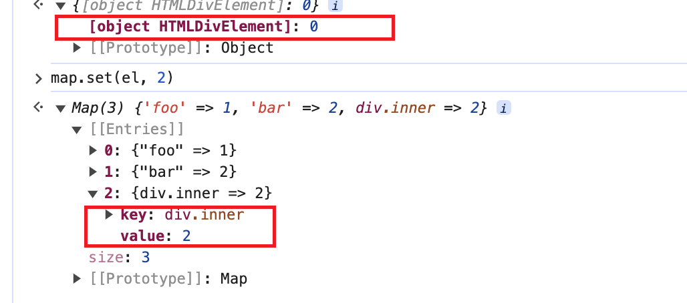

# Js相关

## 1. Js的基础类型，typeof和instanceof的区别

基础类型有：`boolean、string、number、bigint、undefined、symbol、null`。

`typeof`能识别所有的值类型，识别函数，能区分是否是引用类型。

```js
const a = "str";
console.log("typeof a :>> ", typeof a); // typeof a :>>  string

const b = 999;
console.log("typeof b :>> ", typeof b); // typeof b :>>  number

const c = BigInt(9007199254740991);
console.log("typeof c :>> ", typeof c); // typeof c :>>  bigint

const d = false;
console.log("typeof d :>> ", typeof d); // typeof d :>>  boolean

const e = undefined;
console.log("typeof e :>> ", typeof e); // typeof e :>>  undefined

const f = Symbol("f");
console.log("typeof f :>> ", typeof f); // typeof f :>>  symbol

const g = null;
console.log("typeof g :>> ", typeof g); // typeof g :>>  object

const h = () => {};
console.log("typeof h :>> ", typeof h); // typeof h :>>  function

const i = [];
console.log("typeof i :>> ", typeof i); // typeof i :>>  object

Object.prototype.toString.call(i) // "[object Array]"
```

`instanceof`用于检测构造函数的 `prototype` 属性是否出现在某个实例对象的原型链上。

## 2. 数组的forEach和map方法有哪些区别？常用哪些方法去对数组进行增、删、改

- forEach是对数组的每一个元素执行一次给定的函数。
- map是创建一个新数组,该新数组由原数组的每个元素都调用一次提供的函数返回的值。
- pop():删除数组后面的最后一个元素,`返回值为被删除的那个元素`。
- push():将一个元素或多个元素添加到数组末尾，并`返回新的长度`。
- shift():删除数组中的第一个元素，并`返回被删除元素的值`。
- unshift():将一个或多个元素添加到数组的开头，并`返回该数组的新长度`。
- splice():通过删除或替换现有元素或者原地添加新的元素来修改数组，`并以数组形式返回被修改的内容`。
- reverse(): 反转数组。

```js
const arr = [1, 2, 3, 4, 5, 6];

arr.forEach(x => {
  x = x + 1;
  console.log("x :>> ", x);
});
// x :>>  2
// x :>>  3
// x :>>  4
// x :>>  5
// x :>>  6
// x :>>  7

console.log("arr :>> ", arr); // arr :>>  [ 1, 2, 3, 4, 5, 6 ]

const mapArr = arr.map(x => {
  x = x * 2;
  return x;
});
console.log("mapArr :>> ", mapArr); // mapArr :>>  [ 2, 4, 6, 8, 10, 12 ]
console.log("arr :>> ", arr); // arr :>>  [ 1, 2, 3, 4, 5, 6 ]

const popArr = arr.pop();
console.log("popArr :>> ", popArr); // popArr :>>  6
console.log("arr :>> ", arr); // arr :>>  [ 1, 2, 3, 4, 5 ]

const pushArr = arr.push("a");
console.log("pushArr :>> ", pushArr); // pushArr :>>  6
console.log("arr :>> ", arr); // arr :>>  [ 1, 2, 3, 4, 5, 'a' ]

const shiftArr = arr.shift();
console.log("shiftArr :>> ", shiftArr); // shiftArr :>>  1
console.log("arr :>> ", arr); // arr :>>  [ 2, 3, 4, 5, 'a' ]

const unshiftArr = arr.unshift("b", "c");
console.log("unshiftArr :>> ", unshiftArr); // unshiftArr :>>  7
console.log("arr :>> ", arr); // arr :>>  ['b', 'c', 2,3,4,5,'a']

const spliceArr = arr.splice(2, 4, "d", "e");
console.log("spliceArr :>> ", spliceArr); // spliceArr :>>  [ 2, 3, 4, 5 ]
console.log("arr :>> ", arr); // arr :>>  [ 'b', 'c', 'd', 'e', 'a' ]

//var arr = [3,4,5]
//arr.splice(2, 0, 12) //[]
//arr.splice(2, 1) //[12]
//arr.splice(2, 1, 14) //[5]

const reverseArr = arr.reverse();
console.log("reverseArr :>> ", reverseArr); // reverseArr :>>  [ 'a', 'e', 'd', 'c', 'b' ]
console.log("arr :>> ", arr); // arr :>>  [ 'a', 'e', 'd', 'c', 'b' ]
console.log("reverseArr === arr :>> ", reverseArr === arr); // reverseArr === arr :>>  true

```
## 3. string方法？substr和substring区别？

```js
//charAt
var str = 'woshistring'
str.charAt(4) //'i'
str.at(4)
//charCodeAt
str.charCodeAt(4) //105
//concat
var str2 = 'concat'
str.concat(str2) //'woshistringconcat'
//indexOf 对大小写敏感
str.indexOf('s') //2
//match 对大小写敏感
str.match('string') //['string', index: 5, input: 'woshistring', groups: undefined]
//replace 
str.replace('str', 'num') //'woshinuming'
// search
str.search('o') //1
//slice 不包括最后一位
str.slice(2,4) //'sh'
str.slice(-2) //'ng'
str.slice(-4, -2) //'ri'
//split
str.split('') //['w', 'o', 's', 'h', 'i', 's', 't', 'r', 'i', 'n', 'g']
//toLocaleLowerCase
str.toLocaleLowerCase()
str.toLocaleUpperCase() //'WOSHISTRING'
//toUpperCase() toLowerCase()
//substr(start, len)
str.substr(2) //'shistring'
str.substr(2, 5) //'shist'
str.substr(-2) //'ng'
str.substr(-4, -2) // ''
//substring 不支持负数
str.substring(2) //'shistring'
str.substring(2, 5) // 'shi'
str.substring(-2) //不支持
//for of
for(let i of str){console.log(i)}
//includes
str.includes('str') //true
//startsWith
str.startsWith('wo') //true
//endsWith
str.endsWith('ing') //true
str.endsWith('ing', 5) //false
//repeat
str.repeat(2)// 'woshistringwoshistring'
//padStart  padEnd
str.padStart(13, 'x')
str.padEnd(13, 'x') //'woshistringxx'

```
区别：
substr第二个参数是截取长度，substring是endIndex

## 4. 闭包和作用域

闭包是作用域应用的特殊场景。 js中常见的作用域包括全局作用域、函数作用域、块级作用域。要知道js中自由变量的查找是在函数定义的地方，向上级作用域查找，不是在执行的地方。 常见的闭包使用有两种场景：一种是函数作为参数被传递；一种是函数作为返回值被返回。

```js
// 函数作为返回值
function create() {
  let a = 100;
  return function () {
    console.log(a);
  };
}

const fn = create();
const a = 200;
fn(); // 100

// 函数作为参数被传递
function print(fb) {
  const b = 200;
  fb();
}
const b = 100;
function fb() {
  console.log(b);
}
print(fb); // 100
```

## 6. 如何实现继承（原型和原型链）

### js中原型和原型链指的是什么

JavaScript中的原型（Prototype）和原型链（Prototype Chain）是理解JavaScript对象和继承的重要概念。

`JS的每个函数在创建的时候，都会生成一个属性prototype，这个属性指向一个对象，这个对象就是此函数的原型对象`

当我们访问一个对象的属性时，如果该对象本身没有该属性，JavaScript会自动去它的原型对象中查找该属性。这种属性查找的过程称为`原型链`。

具体来说，当我们访问一个对象的属性时，JavaScript引擎首先会在`对象本身的属性中查找`，如果找到了就返回该属性值。如果`没有找到`，它会继续在`原型对象中查找`，如果找到了就返回该属性值。如果仍然没有找到，它会继续在原型对象的原型对象中查找，直到找到该属性或到达原型链的末尾（即原型为null）为止。

通过`原型和原型链`，我们可以`实现对象之间的继`承。当我们创建一个对象时，可以指定其原型对象，从而让该对象继承原型对象的属性和方法。这样，我们可以通过原型链实现属性和方法的共享和复用。

在JavaScript中，原型和原型链是隐式的，但我们可以通过 __proto__ 属性（非标准）或 `Object.getPrototypeOf()` 方法来访问和操作对象的原型。

此外，`ES6引入了 class 和 extends 关键字`，提供了更简洁的语法来定义和继承对象。

总结起来，`原型和原型链是JavaScript中实现对象和继承的基础机制`，理解它们对于深入理解JavaScript的对象模型和继承机制非常重要。

### 方法

- 使用class语法，用extends进行继承,或直接改变对象的__proto__指向。

```js
class Car {
  constructor(brand) {
    this.brand = brand;
  }
  showBrand() {
    console.log("the brand of car :>> ", this.brand);
  }
}

class ElectricCar extends Car {
  constructor(brand, duration) {
    super(brand);
    this.duration = duration;
  }
  showDuration() {
    console.log(`duration of this ${this.brand} ElectricCar :>> `, this.duration);
  }
}

ElectricCar.prototype.showOriginator = function (originator) {
  console.log(`originator of this ElectricCar :>> `, originator);
};

const tesla = new ElectricCar("tesla", "600km");
tesla.showBrand(); // the brand of car :>>  tesla
tesla.showDuration(); // duration of this tesla ElectricCar :>>  600km
console.log("tesla instanceof Car :>> ", tesla instanceof Car); // tesla instanceof Car :>>  true
console.log("tesla instanceof ElectricCar :>> ", tesla instanceof ElectricCar); // tesla instanceof ElectricCar :>>  true
console.log("tesla.__proto__ :>> ", tesla.__proto__); // tesla.__proto__ :>>  Car {}
console.log("ElectricCar.prototype === tesla.__proto__  :>> ", ElectricCar.prototype === tesla.__proto__); // ElectricCar.prototype === tesla.__proto__  :>>  true
tesla.showOriginator("Mask"); // originator of this  ElectricCar :>>  Mask

const bydCar = {
  brand: "比亚迪",
  duration: "666km",
};
bydCar.__proto__ = ElectricCar.prototype;

bydCar.showBrand(); //the brand of car :>>  比亚迪
bydCar.showDuration(); // duration of this 比亚迪 ElectricCar :>>  666km

```

## 7. 箭头函数和普通函数有什么区别

箭头函数不会创建自身的this，只会从上一级继承this，箭头函数的this在定义的时候就已经确认了，之后不会改变。同时箭头函数无法作为构造函数使用，没有自身的prototype，也没有arguments。

```js
this.id = "global";

console.log("this.id :>> ", this.id); // this.id :>>  global

function normalFun() {
  return this.id;
}

const arrowFun = () => {
  return this.id;
};

const newNormal = new normalFun();
console.log("newNormal :>> ", newNormal); // newNormal :>>  normalFun {}
try {
  const newArrow = new arrowFun();
} catch (error) {
  console.log("error :>> ", error); // error :>>  TypeError: arrowFun is not a constructor
}

console.log("normalFun :>> ", normalFun()); // normalFun :>>  undefined
console.log("arrowFun() :>> ", arrowFun()); // arrowFun() :>>  global

const obj = {
  id: "obj",
  normalFun,
  arrowFun,
};

const normalFunBindObj = normalFun.bind(obj);
const arrowFunBindObj = arrowFun.bind(obj);
console.log("normalFun.call(obj) :>> ", normalFun.call(obj)); // normalFun.call(obj) :>>  obj
console.log("normalFunBindObj() :>> ", normalFunBindObj()); // normalFunBindObj() :>>  obj
console.log("arrowFun.call(obj) :>> :>> ", arrowFun.call(obj)); // arrowFun.call(obj) :>> :>>  global
console.log("arrowFunBindObj() :>> ", arrowFunBindObj()); // arrowFunBindObj() :>>  global
console.log("obj.normalFun() :>> ", obj.normalFun()); // obj.normalFun() :>>  obj
console.log("obj.arrowFun() :>> ", obj.arrowFun()); // obj.arrowFun() :>>  global
```

## 8. 迭代器(iterator)接口和生成器(generator)函数的关系

任意一个对象实现了遵守迭代器协议的[Symbol.iterator]方法，那么该对象就可以调用[Symbol.iterator]返回一个遍历器对象。生成器函数就是遍历器生成函数，故可以把generator赋值给对象的[Symbol.iterator]属性，从而使该对象具有迭代器接口。

```js
class ClassRoom {
  constructor(address, name, students) {
    this.address = address;
    this.name = name;
    this.students = students;
  }

  entry(student) {
    this.students.push(student);
  }

  *[Symbol.iterator]() {
    yield* this.students;
  }

  // [Symbol.iterator]() {
  //   let index = 0;
  //   return {
  //     next: () => {
  //       if (index < this.students.length) {
  //         return { done: false, value: this.students[index++] };
  //       } else {
  //         return { done: true, value: undefined };
  //       }
  //     },
  //     return: () => {
  //       console.log("iterator has early termination");
  //       return { done: true, value: undefined };
  //     },
  //   };
  // }
}

const classOne = new ClassRoom("7-101", "teach-one-room", ["rose", "jack", "lily", "james"]);

for (const stu of classOne) {
  console.log("stu :>> ", stu);
  // stu :>>  rose
  // stu :>>  jack
  // stu :>>  lily
  // stu :>>  james
  // if (stu === "lily") return;
}
```

## 9. 浏览器的事件循环机制

`简单记`：同步代码，一行一行放在调用栈中去执行。
遇到异步代码，会先记录下代码，等待执行时机（setimeout, ajax)。时机到了，将之前记录的代码放入回调函数队列。当调用栈为空，也就是同步代码执行完，eventloop开始工作。eventloop会轮询查找回调函数队列中是否有可执行的代码，如有，将代码放入调用栈中执行。没有，则会轮询查找。

首先要知道一件事，JavaScript是`单线程`的（指的是js引擎在执行代码的时候只有一个主线程，每次只能干一件事），同时还是`非阻塞运行`的（执行异步任务的时候，会先挂起相应任务，待异步返回结果再执行回调），这就要知道其事件的循环机制才能正确理解js代码的执行顺序。

在js代码执行时，会将对象存在堆（heap）中，在栈（stack）中存放一些`基础类型变量和对象的指针`。在执行方法时，会根据当前方法的执行上下文，来进行一个执行。对于普通函数就是正常的入栈出栈即可，涉及到`异步任务`的时候，js执行会将对应的任务放到`事件队列`中（`微任务队列、宏任务队列`）。

常见微任务：`queueMicrotask`、`Promise`、`MutationObserve`等。
常见宏任务：`ajax`、`setTimeout`、`setInterval`、`script（js整体代码）`、`IO操作`、`UI交互`、`postMessage`等。

故事件循环可以理解为是一个桥梁，连接着应用程序的js和系统调用之间的通道。其过程为：

- 执行一个宏任务（一般为一段script），若没有可选的宏任务，就直接处理微任务。
- 执行中遇到微任务，就将其添加到微任务的任务队列中。
- 执行中遇到宏任务，就将其提交到宏任务队列中。
- 执行完当前执行的宏任务后，去查询当前有无需要执行的微任务，有就执行
- 检查渲染，若需要渲染，浏览器执行渲染任务
- 渲染完毕后，Js线程会去执行下一个宏任务。。。（如此循环）

```js
console.log("script start");

const promiseA = new Promise((resolve, reject) => {
  console.log("init promiseA");
  resolve("promiseA");
});

const promiseB = new Promise((resolve, reject) => {
  console.log("init promiseB");
  resolve("promiseB");
});

setTimeout(() => {
  console.log("setTimeout run");
  promiseB.then(res => {
    console.log("promiseB res :>> ", res);
  });
  console.log("setTimeout end");
}, 500);

promiseA.then(res => {
  console.log("promiseA res :>> ", res);
});

queueMicrotask(() => {
  console.log("queue Microtask run");
});

console.log("script end");
```

## 10. [浅拷贝和深拷贝是什么？](https://juejin.cn/post/6844904197595332622)

浅拷贝是会将对象的每个属性进行依次复制，但是当对象的属性值是`引用类型`时，实质复制的是其`引用`，当引用指向的值改变时也会跟着变化。 深拷贝复制`变量值`，对于引用数据，则递归至基本类型后，再复制。 深拷贝后的对象与原来的对象是`完全隔离`的，`互不影响`，对一个对象的修改并不会影响另一个对象




总而言之，浅拷贝只复制`指向某个对象的指针`，而`不复制对象本身`，新旧对象还是`共享同一块内存`。但深拷贝会`另外创造一个一模一样的对象`，新对象跟原对象`不共享内存`，修改新对象不会改到原对象。

#### 浅拷贝的实现方式

1. `Object.assign()`

`Object.assign()` 方法可以把任意多个的源对象自身的可枚举属性拷贝给目标对象，然后返回目标对象。

```js
let obj1 = { person: {name: "kobe", age: 41},sports:'basketball' };
let obj2 = Object.assign({}, obj1);
obj2.person.name = "wade";
obj2.sports = 'football'
console.log(obj1); // { person: { name: 'wade', age: 41 }, sports: 'basketball' }
```

2. 函数库lodash的`_.clone`方法
3. 展开运算符...

展开运算符是一个 `es6 / es2015`特性，它提供了一种非常方便的方式来执行浅拷贝，这与 `Object.assign ()`的功能相同。

```js
let obj1 = { name: 'Kobe', address:{x:100,y:100}}
let obj2= {... obj1}
obj1.address.x = 200;
obj1.name = 'wade'
console.log('obj2',obj2) // obj2 { name: 'Kobe', address: { x: 200, y: 100 } }
```
4. `Array.prototype.concat()`

```js
let arr = [1, 3, {
    username: 'kobe'
    }];
let arr2 = arr.concat();    
arr2[2].username = 'wade';
console.log(arr); //[ 1, 3, { username: 'wade' } ]
```

5. `Array.prototype.slice()`

```js
let arr = [1, 3, {
    username: ' kobe'
    }];
let arr3 = arr.slice();
arr3[2].username = 'wade'
console.log(arr); // [ 1, 3, { username: 'wade' } ]
```
#### 深拷贝的实现方式

1. `JSON.parse(JSON.stringify())`

```js
let arr = [1, 3, {
    username: ' kobe'
}];
let arr4 = JSON.parse(JSON.stringify(arr));
arr4[2].username = 'duncan'; 
console.log(arr, arr4)
```



这也是利用JSON.stringify将对象转成JSON字符串，再用JSON.parse把字符串解析成对象，一去一来，新的对象产生了，而且对象会开辟新的栈，实现深拷贝。

`这种方法虽然可以实现数组或对象深拷贝,但不能处理函数和正则`，因为这两者基于JSON.stringify和JSON.parse处理后，得到的正则就不再是正则（变为空对象），得到的函数就不再是函数（变为null）了。

比如下面的例子:

```js
let arr = [1, 3, {
    username: ' kobe'
},function(){}];
let arr4 = JSON.parse(JSON.stringify(arr));
arr4[2].username = 'duncan'; 
console.log(arr, arr4)
```


2. 函数库lodash的`_.cloneDeep`方法
3. `jQuery.extend()`方法

jquery 有提供一個`$.extend`可以用来做 Deep Copy

```js
//$.extend(deepCopy, target, object1, [objectN])
var $ = require('jquery');
var obj1 = {
    a: 1,
    b: { f: { g: 1 } },
    c: [1, 2, 3]
};
var obj2 = $.extend(true, {}, obj1);
console.log(obj1.b.f === obj2.b.f); // false
```
4. 手写深拷贝

[跳转到其他页面](/handwriting#手写一个深拷贝)

## 11. JavaScript 防抖（debounce）与节流（thorttle）

`防抖（Debounce）` 和 `节流（Throttle）` 技术用于限制函数执行的次数。通常，一个函数将被执行多少次或何时执行由开发人员决定。但在某些情况下，开发人员会将这种能力赋予用户，由用户决定执行该功能的时间和次数。

例如，添加到`click、scroll、resize`等事件上的函数，允许用户决定何时执行它们以及执行多少次。有时，用户可能会比所需更频繁地执行这些操作。这可能不利于网站的性能，特别是如果附加到这些事件的函数执行一些繁重的计算。在这种情况下，用户可以控制函数的执行，开发人员必须设计一些技术来限制用户可以执行函数的次数。

举个例子，假设我们为滚动事件`scroll`添加了一个函数，该函数中会执行`修改DOM元素`的操作。我们知道，修改DOM元素大小开销很大，会引起`浏览器的回流（Reflow）和重排（Repaint）`，以及重新渲染整个或部分页面。如果用户频繁滚动，导致该函数频繁被调用，可能会`影响网页性能或导致页面卡顿等`。
此外，有些事件回调函数中包含`ajax等异步操作`的时候，多次触发会导致`返回的内容结果顺序不一致`，而导致得到的结果非最后一次触发事件对应的结果

所以，为了优化网页的性能，控制函数被调用的频率是很有必要的，`防抖（Debounce） 和 节流（Throttle）` 是通过控制函数被调用的频率来优化脚本性能的两种方法

### 防抖（Debounce）

>防抖：无论用户触发多少次事件，对应的回调函数只会在事件停止触发指定事件后执行。（即：回调函数在事件停止触发指定时间后被调用）



例如，假设用户在 `100 毫秒内点击了 5 次按钮`。防抖技术不会让这些点击中的任何一个执行对应的回调函数。一旦用户停止点击，如果去抖时间为 100 毫秒，则回调函数将在 100 毫秒后执行。因此，肉眼看来，防抖就像将多个事件组合成一个事件一样。

#### 防抖函数的实现

[跳转到其他页面](/handwriting#手写防抖和节流函数)

#### 防抖的实际应用

- 搜索框建议项
    通常，搜索框会提供下拉菜单，为用户当前的输入提供自动完成选项。但有时建议项是通过请求后端得到的。可以在实现提示文本时应用防抖，在等待用户停止输入一段时间后再显示建议文本。因此，在每次击键时，都会等待几秒钟，然后再给出建议。
- 消除`resize`事件处理程序的抖动。
    window 触发 resize 的时候，不断的调整浏览器窗口大小会不断触发这个事件，用防抖让其只触发一次
- 自动保存
    例如掘金一类的网站，都会内嵌文本编辑器，在编辑过程中会自动保存文本，防止数据丢失。每次保存都会与后端进行数据交互，所以可以应用防抖，在用户停止输入后一段时间内再自动保存。
- 手机号、邮箱等输入验证检测
    通常对于一些特殊格式的输入项，我们通常会检查格式。我们可以应用防抖在用户停止输入后一段时间再进行格式检测，而不是输入框中内容发生改变就检测。
- 在用户停止输入之前不要发出任何 Ajax 请求

### 节流

> 节流：无论用户触发事件多少次，附加的函数在给定的时间间隔内只会执行一次。（即：回调函数在规定时间内最多执行一次）



例如，当用户单击一个按钮时，会执行一个在控制台上打印Hello, world的函数。现在，假设对这个函数应用 1000 毫秒的限制时，无论用户点击按钮多少次，Hello, world在 1000 毫秒内都只会打印一次。节流可确保函数定期执行。

#### 节流函数的实现

[跳转到其他页面](/handwriting#节流)

很多现有的库中已经实现了防抖函数和节流函数，例如[lodash](https://www.lodashjs.com/)

#### 节流的实际应用

1. 游戏中通过按下按钮执行的关键动作（例如：射击、平A）

拿王者荣耀为例，通常都有攻速一说。如果攻速低，即使 n 毫秒内点击平A按钮多次，也只会执行一次平A。其实这里就类似于节流的思想，可以通过设置节流的时间间隔限制，来改变攻速。

2. 滚动事件处理

如果滚动事件被触发得太频繁，可能会影响性能，因为它包含大量视频和图像。因此滚动事件必须使用节流

3. 限制`mousemove/touchmove`事件处理程序

### 小结

1. 如何选择防抖和节流

关于防抖函数和节流函数的选择，一篇博客中是这样建议的: 

> A debounce is utilized when you only care about the final state. A throttle is best used when you want to handle all intermediate states but at a controlled rate.

即：如果只关心最终状态，建议使用防抖。如果是想要函数以可控的速率执行，那么建议使用节流。

2. 延时多久合理

- 大多数屏幕的刷新频率是每秒`60Hz`，浏览器的渲染页面的标准帧率也为`60FPS`，浏览器每秒会重绘`60次`，而每帧之间的时间间隔是`DOM视图更新的最小间隔`。
- 一个平滑而流畅的动画，最佳的循环间隔即`帧与帧的切换时间希望是 16.6ms(1s/60)内`,也意味着17ms内的多次DOM改动会被合并为一次渲染。
- 当执行回调函数时间`大于16.6ms`（系统屏幕限制的刷新频率），UI将会出现`丢帧`(即UI这一刻不会被渲染)，且`丢帧`越多，引起`卡顿情况更严重`。



## 12. var let const区别？

`var、let和const`是JavaScript中声明变量的关键字，它们之间有一些区别。

1. var：`在ES5及之前的版本中使用`的声明变量的关键字。它`具有函数作用域或全局作用域`，而没有块var声明的变量`存在变量提升`，即变量可以在声明之前调用，值为undefined
`let和const不存在变量提升`，即它们所声明的变量一定要在声明后使用，否则`报错`
2. var不存在暂时性死区, let和const存在暂时性死区，只有等到声明变量的那一行代码出现，才可以获取和使用该变量
3. var不存在块级作用域, let和const存在块级作用域
4. `var允许重复声明变量`, `let和const`在`同一作用域不允许`重复声明变量
5. var和let可以修改声明的变量, const声明一个只读的常量。一旦声明，常量的值就不能改变

能用const的情况尽量使用const，其他情况下大多数使用let，避免使用var

## 13. map和set的区别

在JavaScript中，Map和Set是两种不同的数据结构，它们有以下区别：

- 存储的数据类型：`Map可以存储键值对`（key-value pair），而`Set只能存储唯一的值`，不允许重复。
- 键的类型：`Map的键可以是任意数据类型`，包括基本数据类型和引用数据类型，`Set 可以存储任意类型的值`，包括基本数据类型和引用数据类型。
- 迭代顺序：`Map会按照插入的顺序保持键值对的迭代顺序`，而`Set不保证迭代顺序与插入顺序一致`。
- 键的唯一性：`Map中的键是唯一的`，不会出现重复的键，而`Set中的值也是唯一的`，不会出现重复的值。
- 大小和性能：`Map可以通过size属性获取键值对的数量`，而`Set可以通过size属性获取值的数量`。在大规模数据操作时，Map的性能比Set略低。
根据具体的需求，选择使用Map还是Set会有所不同。如果`需要存储键值对并需要按照插入顺序进行迭代`，可以使用`Map`。如果`只需要存储唯一的值`，并且不关心顺序，可以使用`Set`。

## 14. 正向代理和反向代理指的是什么？

在Web前端中，正向代理（Forward Proxy）和反向代理（Reverse Proxy）是两种不同的代理服务器的概念。

- `正向代理`：正向代理是客户端与目标服务器之间的中间服务器。当客户端请求访问目标服务器时，请求首先发送到正向代理服务器，然后由代理服务器转发请求给目标服务器，并将响应返回给客户端。客户端对目标服务器的存在是不可见的，目标服务器也无法感知到客户端的真实IP地址。正向代理常用于访问被限制或阻止的资源，或者提供缓存、加速、安全性等功能。
- `反向代理`：反向代理是位于目标服务器前面的中间服务器。当客户端发送请求时，请求首先发送到反向代理服务器，然后由代理服务器根据一定的规则将请求转发给后端的目标服务器进行处理。客户端对目标服务器的存在是不可见的，目标服务器也无法感知到客户端的真实IP地址。反向代理常用于负载均衡、缓存、安全性等方面，可以提高系统的可靠性、可伸缩性和安全性。

总结来说，正向代理是客户端通过代理服务器访问目标服务器，而反向代理是客户端通过代理服务器访问后端的目标服务器。它们在代理的方向和作用上有所不同，但都可以用于提供访问控制、性能优化和安全性等功能。

### 正向代理和反向代理的异同点

- 同： 
    1. 正向代理和反向代理中的服务器都是对请求和响应进行转发。 
    2. 都能提高访问速度。 
    3. 帮助客户端或业务服务器隐藏真实的IP。
- 异： 
    1. 部署的位置不同 正向代理部署在客户端，反向代理部署在服务器端。 
    2. 作用不同 正向代理是客户端的代理，帮助客户端突破访问控制；反向代理是服务器的代理，帮助服务器实现负载均衡，安全防护。

## 15. settimeout怎么解决倒计时时间偏差的问题

在处理倒计时时间偏差的问题时，可以使用 setTimeout 结合当前时间来进行校准。以下是一种解决方案：

1. 获取当前时间戳：使用 Date.now() 获取当前的时间戳。
2. 计算倒计时时间差：计算目标时间与当前时间的时间差，得到倒计时的剩余毫秒数。
3. 设置 setTimeout ：使用 setTimeout 函数设置一个定时器，延迟等于倒计时时间差的毫秒数。
4. 倒计时结束处理：当定时器触发后，执行倒计时结束的处理逻辑。 

这种方法可以通过动态计算当前时间与目标时间的差异来校准倒计时，从而避免时间偏差的问题。 以下是一个示例代码：

```js
function startCountdown(targetTime) {
  const currentTime = Date.now();
  const timeDifference = targetTime - currentTime;

  if (timeDifference <= 0) {
    // 倒计时结束的处理逻辑
    console.log("倒计时结束");
    return;
  }

  setTimeout(() => {
    // 倒计时结束的处理逻辑
    console.log("倒计时结束");
  }, timeDifference);
}

// 示例使用：设置目标时间为当前时间加上 10 秒
const targetTime = Date.now() + 10000;
startCountdown(targetTime);

```

## 16. [weakMap()和map的区别](https://juejin.cn/post/6844903837707272199)

### Map

#### Map代码示例

`Map`的键和值可以是`任何数据类型`，键值对按照`插入顺序排列`，如果插入重复的键值，后面的键值会覆盖前者，下段代码是个简单示例，演示了Map的一些用法：

```js
let map = new Map();
let o = {n: 1};
map.set(o, "A"); //add
map.set("2", 9);
console.log(map.has("2")); //check if key exists
console.log(map.get(o)); //retrieve value associated with key
console.log(...map);
console.log(map);
map.delete("2"); //delete key and associated value
map.clear(); //delete everything
//create a map from iterable object
let map_1 = new Map([[1, 2], [4, 5]]);
console.log(map_1.size); //number of keys
```

上述代码将会输出

```js
true
A
[ { n: 1 }, 'A' ] [ '2', 9 ]
Map { { n: 1 } => 'A', '2' => 9 }
2
```

从上述代码中，我们可以看出使用`new Map()`语法进行声明，`map键`的类型可以使用`任意对象`作为键（字符串，object类型,functions），我们直接二维数组键值对的形传入到构建函数中，第一项为键，后一项为值。

```js
const map=new Map([['foo',1],['foo',2]])
console.log(map);
console.log(map.get('foo'))
```

上述代码将会输出：

```js
Map { 'foo' => 2 }
2
```

上述代码我们可以看出，如果`存在相同的键`，则会按照`FIFO（First in First Out,先进先出）`原则，后面的键值信息会`覆盖`前面的键值信息。

#### Map常用方法示例

| 操作方法 | 内容描述 |
| ------ | ------ |
| `map.set(key,value)` | 添加键值对到映射中 |
| `map.get(key) `| 获取映射中某一个键的对应值 |
| `map.delete(key)` | 将某一键值对移除映射 |
| `map.clear()` | 清空映射中所有键值对 |
| `map.entries()` | 返回一个以二元数组（键值对）作为元素的数组 |
| `map.has(key)` | 检查映射中是否包含某一键值对 |
| `map.keys()` | 返回一个当前映射中所有键作为元素的可迭代对象 |
| `map.values()` | 返回一个当前映射中所有值作为元素的可迭代对象 |
| `map.size` | 映射中键值对的数量 |

##### 增删键值对与清空MAP

```js
let user={name:"Aaron",id:1234};
let userHobbyMap=new Map();
userHobbyMap.set(user,['Ice fishing','Family Outting']);//添加键值对
console.log(userHobbyMap);
userHobbyMap.delete(user);//删除键值对
userHobbyMap.clear(); //清空键值对
console.log(userHobbyMap);
```

上述代码将会输出

```js
Map { { name: 'Aaron', id: 1234 } => [ 'Ice fishing', 'Family Outting' ] }
Map {}
```

##### 获取键值对

与Set集合对象不一样，集合对象的元素没有元素位置的标识，故没有办法获取集合某元素，但是映射对象由键值对组成，所以可以利用键来获取对应的值。

```js
const map=new Map();
map.set('foo', 'bar');
console.log(map.get('foo')); //output bar
```

##### 检查映射对象中是否存在某键

```js
const map=new Map([['foo',1]])
console.log(map.has('foo'));//output true
console.log(map.has('bar'));//output false
```

##### 遍历映射中的键值对

映射对象在设计上同样也是一种`可迭代的对象`，可以通过`for-of`循环对其遍历，同时也可以使用f`oreach`进行遍历。
映射对象中带有`entries()`方法，用于返回包含所有键值对的可迭代的`二元数组对象`，而for-of和foreach便是先利用entries()方法先将映射对象转换成一个类数组对象，然年再进行迭代。

```js
const map=new Map([['foo',1],['bar',2]]);
console.log(Array.from(map.entries()));
//output
//[ [ 'foo', 1 ], [ 'bar', 2 ] ]
for(const [key,value] of map){
    console.log(`${key}:${value}`);
}
//output
//foo:1
//bar:2
map.forEach((value,key,map)=>
  console.log(`${key}:${value}`))
//output
//foo:1
//bar:2
```

#### Map与Object的区别

| 对比项 | 映射对象Map | Object对象 |
| ----- | ---------- | --------- |
| 存储键值对 | ✔️ |  ✔️ | 
| 遍历所有的键值对 |  ✔️ |  ✔️ | 
| 检查是否包含指定的键值对 | ✔️ |  ✔️ | 
| 使用字符串作为键 | ✔️ |  ✔️ |
| 使用Symbol作为键 | ✔️ | ✔️ |
| 使用任意对象作为键 | ✔️ | ✔️ |
| 可以很方便的得知键值对的数量 | ✔️ | ✔️ |

从中我们可以看出`Map对象可以使用任何对象作为键`，这就解决了我们实际应用中一个很大的痛点，比如现在一个DOM对象作为键时，Object就不是那么好用了。



### WeakMap

与`集合类型（Set）`一样，映射类型也有一个Weak版本的`WeakMap`。WeakMap和WeakSet很相似，只不过`WeakMap的键会检查变量的引用`，`只要其中任意一个引用被释放，该键值对就会被删除`。

以下三点是Map和WeakMap的主要区别： 
1. `Map对象`的键可以是`任何类型`，但`WeakMap对象`中的键只能是`对象引用` 
2. `WeakMap不能包含无引用的对象，否则会被自动清除出集合（垃圾回收机制）`。 
3. `WeakMap对象`是`不可枚举`的，`无法获取大小`。

下段代码示例验证了WeakMap的以上特性:

```js
let weakmap = new WeakMap();
(function(){ 
  let o = {n: 1}; 
  weakmap.set(o, "A");
})();  // here 'o' key is garbage collected
let s = {m: 1};
weakmap.set(s, "B");
console.log(weakmap.get(s));
console.log(...weakmap); // exception thrown
weakmap.delete(s);
weakmap.clear(); // Exception, no such function
let weakmap_1 = new WeakMap([[{}, 2], [{}, 5]]); //this works
console.log(weakmap_1.size); //undefined”
```

```js
const weakmap=new WeakMap();
let keyObject={id:1};
const valObject={score:100};
weakmap.set(keyObject, valObject);
console.log(weakmap.get(keyObject));
//output { score: 100 }
keyObject=null;
console.log(weakmap.has(keyObject));
//output false
```

## 17. weakSet()和Set的区别

在开发过程中，我们会经常使用到数组`Array`这种引用类型的数据结构，并十分清楚数组是种`有序的集合`，并且每个元素都可以使用数字下标的形式获取。但是在一些业务场景中，我们并不需要集合维护一个有序的状态，甚至有些场景需要无序集合，因此ES6里加入了`无序集合Set和其的Weak版本WeakSet`。

### Set

#### Set代码示例

Set需要使用新语法new Set()声明，代码如下:

```js
let set = new Set("Hello!!!");
set.add(12); //add 12
console.log(set.has("!")); //check if value exists
console.log(set.size);
set.delete(12); //delete 12
console.log(...set);
set.clear(); //delete all values”
//output
//true
//6
//H e l o !
```
这段代码我们向`Set集合`里添加了一个`字符串和数字`，`字符串在Set集合里会被拆分成字符`进行存储，由于`Set集合去重`的特点，l和!重复将会被去重（ Set { 'h', 'e', 'l', 'o' ,'!'}），使用`add`方法添加了12到Set集合里，因此集合的大小是6。

#### Set与Array的区别

| 对比项 | Array | Set |
| ----- | ------ | ---- |
| 元素序列 | 有序 | 无序 | 
| 元素可重复性 | 可重复 | 不可重复 |

#### Set常用方法

| 方法 | 介绍 |
| ---- | ---- |
| `set.add(value)` | 添加元素到集合内 |
| `set.delete(value)` | 删除元素的指定元素 | 
| `set.clear()` | 清空集合内元素 |
| `set.forEach(callbackFn,[,context])` | 遍历集合内所有元素，并作为CallbackFn的参数进行调用 |
| `set.has(value)` | 	检查集合内是否含有某元素 |

##### 添加删除清空

```js
const set=new Set();
set
 .add(1)
 .add(2)
 .add(3)
 .add(3);//不起作用，因为3已经在集合中
console.log(set);//output Set { 1, 2, 3 }

//删除元素
set.delete(2);
console.log(set);//output Set {1,3}

//清空集合
set.clear();
console.log(set); //output Set{}
```
##### 检查元素

因为`Set集合里没有排序`的概念，因此我们`无法使用Array的IndexOf的方法判断是否大于0来检验是否含有某元素`，ES6里使用了更简洁、更易懂的方法来检验是否含有某元素。

```js
const set=new Set([1,2,3,4]);
set.has(2) //output true;
set.has(5) //output false;
```

##### 遍历元素

集合对象自身定义了forEach方法，跟数组类型的foreach一样,示例代码如下：

```js
const set=new Set([1,2,3,4]);
set.forEach(item=>{
  console.log(item);
})
//output
//1
//2
//3
//4
```

### WeakSet

#### WeakSet介绍

`JavaScript垃圾回收是一种内存管理技术`。在这种技术中，`不再被引用的对象会被自动删除，而与其相关的资源也会被一同回收`。Set中对象的引用都是强类型化的，并不会允许垃圾回收。这样一来，如果Set中引用了不再需要的大型对象，如已经从DOM树中删除的DOM元素，那么其回收代价是昂贵的。

为了解决这个问题，ES6还引入了`WeakSet的弱集合`。这些集合之所以是“弱的”，是因为它们`允许从内存中清除不再需要的被这些集合所引用的对象`。

首先让我们了解下WeakSet与Set的不同，以下三点是WeakSet与Set不一样的地方：

1. `Set可以存储值类型和对象引用类型，而WeakSet只能存储对象引用类型，否则会抛出TypeError`。
2. `WeakSet不能包含无引用的对象，否则会被自动清除出集合（垃圾回收机制）`。
3. `WeakSet对象是不可枚举的，也就是说无法获取大小，也无法获取其中包含的元素。`

如下段的代码验证了上述特性：

```js
let weakset = new WeakSet();
(function(){ 
   let a = {}; 
   weakset.add(1); //TypeError: Invalid value used in weak set
   weakset.add(a);
})();  //here 'a' is garbage collected from weakset
console.log()
console.log(weakset.size); //output "undefined"
console.log(...weakset); //Exception is thrown
weakset.clear(); //Exception, no such function

```

```js
const weakset=new WeakSet();
let foo={bar:1};
weakset.add(foo);
console.log(weakset.has(foo)); //output true
foo=null;
console.log(weakset.has(foo)); //output false

```

## 18 了解v8引擎是如何运行js

> javascript是运行时编译（jit）：javascript(parser解析器)ast抽象语法书（interpreter解释器）bytecode字节码（compiler编译器）机器代码

**chrome的js引擎是v8、nodejs的运行时环境是v8引擎、electron的底层引擎也是v8**

>v8是用c++编写的google开元高性能javascript和WebAssembly引擎，它用于chrome和nodejs等。实现了ECMAScript和WebAssembly,并在wendows7或更高版本，macOS10.12+和使用x64，IA-32,ARM或MIPS处理器的linux系统上运行。
人话就是v8是一个接收javascript代码，编译代码然后执行的c++程序，编译后的代码可以在多种操作系统、多种处理器上运行。


