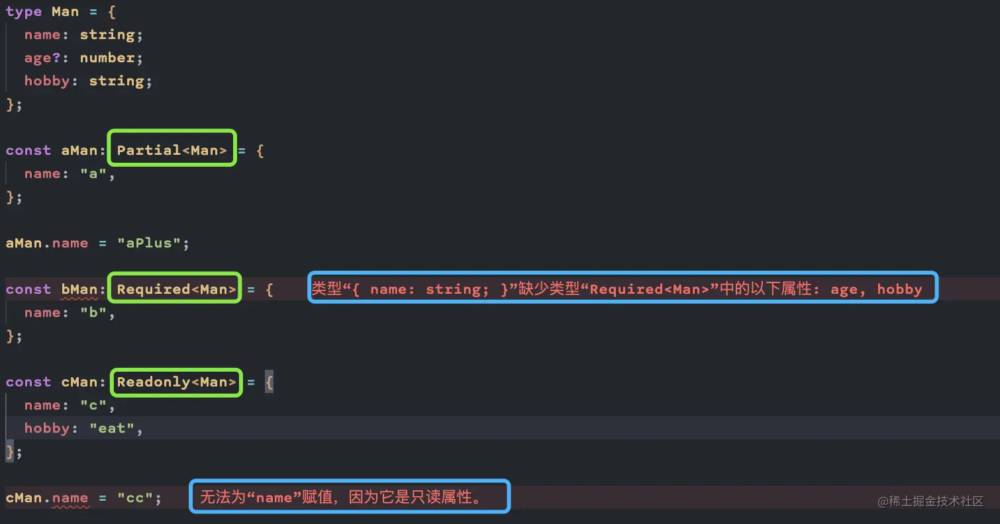
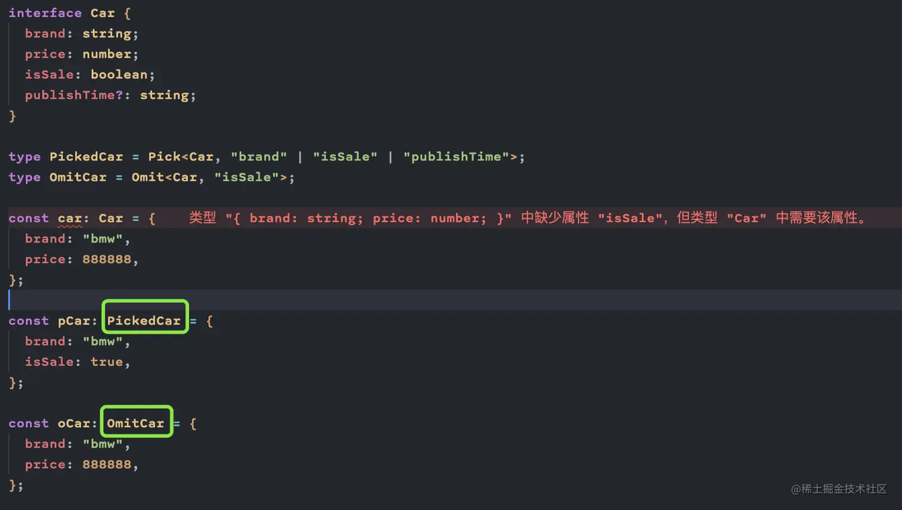
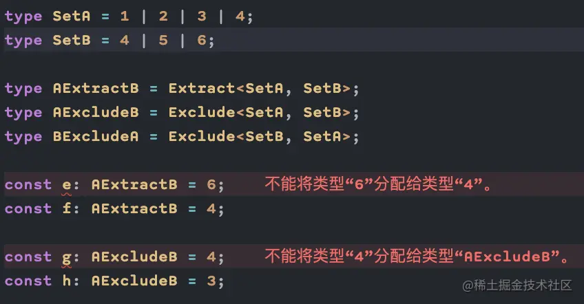

# TypeScript

>Typescript 是一个强类型的 JavaScript 超集，支持ES6语法，支持面向对象编程的概念，如类、接口、继承、泛型等。Typescript并不直接在浏览器上运行，需要编译器编译成纯Javascript来运行。


## 1. 为什么要使用 TypeScript ? TypeScript 相对于 JavaScript 的优势是什么？

增加了静态类型，可以在开发人员编写脚本时检测错误，使得代码质量更好，更健壮。

优势:
1. 杜绝手误导致的变量名写错;
2. 类型可以一定程度上充当文档;
3. IDE自动填充，自动联想;

区别
- TypeScript 是 JavaScript 的超集，扩展了 JavaScript 的语法
- TypeScript 文件的后缀名 .ts （.ts，.tsx，.dts），JavaScript 文件是 .js

## 2. type和interface的区别

- `interface`可以`重复声明`，type不行
- `继承方式`不一样，type使用`交叉类型`方式，interface使用`extends`实现。在对象扩展的情况下，使用接口继承要比交叉类型的性能更好。建议使用interface来描述对象对外暴露的借口，使用type将一组类型重命名（或对类型进行复杂编程）,简单来说，如果不清楚什么时候用interface/type，能用 interface 实现，就用 interface , 如果不能就用 type 。。
- type 可以声明基本类型别名，联合类型，元组等类型, type 语句中还可以使用 typeof 获取实例的 类型进行赋值

```js
interface iMan {
  name: string;
  age: number;
}
// 接口可以进行声明合并
interface iMan {
  hobby: string;
}

type tMan = {
  name: string;
  age: number;
};
// type不能重复定义
// type tMan = {}

// 继承方式不同,接口继承使用extends
interface iManPlus extends iMan {
  height: string;
}
// type继承使用&，又称交叉类型
type tManPlus = { height: string } & tMan;

const aMan: iManPlus = {
  name: "aa",
  age: 15,
  height: "175cm",
  hobby: "eat",
};

const bMan: tManPlus = {
  name: "bb",
  age: 15,
  height: "150cm",
};

// 基本类型别名
type Name = string

// 联合类型
interface Dog {
    wong();
}
interface Cat {
    miao();
}

type Pet = Dog | Cat

// 具体定义数组每个位置的类型
type PetList = [Dog, Pet]
// 当你想获取一个变量的类型时，使用 typeof
let div = document.createElement('div');
type B = typeof div
```
## 3. any、unkonwn、never? TypeScript 中 any、never、unknown、null & undefined 和 void 有什么区别

>`any`: 为编程阶段还不清楚类型的变量指定一个类型。 这些值可能来自于动态的内容，比如来自用户输入或第三方代码库。 这种情况下，我们不希望类型检查器对这些值进行检查而是直接让它们通过编译阶段的检查。

>`never`: 永不存在的值的类型。例如：never 类型是那些总是会抛出异常或根本就不会有返回值的函数表达式或箭头函数表达式的返回值类型。

>`unknown`: 任何类型的值都可以赋给 unknown 类型，但是 unknown 类型的值只能赋给 unknown 本身和 any 类型。

>`null & undefined`: 默认情况下 null 和 undefined 是所有类型的子类型。 就是说你可以把 null 和  undefined 赋值给 number 类型的变量。当你指定了 --strictNullChecks 标记，null 和 undefined 只能赋值给 void 和它们各自。

>`void`: 没有任何类型。例如：一个函数如果没有返回值，那么返回值可以定义为void。

`any`和`unkonwn`在TS类型中属于最顶层的`Top Type`，即所有的类型都是它俩的`子类型`。而`never`则相反，它作为`Bottom Type`是所有类型的子类型。

`unknown` 和 `any` 的主要区别是 `unknown` 类型会更加严格：在对 unknown 类型的值执行大多数操作之前，我们必须进行某种形式的检查。而在对 any 类型的值执行操作之前，我们不必进行任何检查。

```js
let foo: any = 123;
console.log(foo.msg); // 符合TS的语法
let a_value1: unknown = foo; // OK
let a_value2: any = foo; // OK
let a_value3: string = foo; // OK
let bar: unknown = 222; // OK
console.log(bar.msg); // Error
let k_value1: unknown = bar; // OK
let K_value2: any = bar; // OK
let K_value3: string = bar; // Error
```

因为bar是一个未知类型(任何类型的数据都可以赋给 unknown 类型)，所以不能确定是否有msg属性。不能通过TS语法检测；而 unknown 类型的值也不能将值赋给 any 和 unknown 之外的类型变量

总结：

`any 和 unknown 都是顶级类型，但是 unknown 更加严格，不像 any 那样不做类型检查，反而 unknown 因为未知性质，不允许访问属性，不允许赋值给其他有明确类型的变量`

## 4. 常见的工具类型

- `Partial`：满足部分属性(一个都没满足也可)即可
- `Required`：所有属性都需要
- `Readonly`: 包装后的所有属性只读



- `Pick`: 选取部分属性
- `Omit`: 去除部分属性



- `Extract`: 交集
- `Exclude`: 差集



## 5. TypeScript 中 const 和 readonly 的区别？枚举和常量枚举的区别？接口和类型别名的区别？

- `const 和 readonly`: const可以防止变量的值被修改，readonly可以防止变量的属性被修改。
- `枚举和常量枚举`: 常量枚举只能使用常量枚举表达式，并且不同于常规的枚举，它们在编译阶段会被删除。 常量枚举成员在使用的地方会被内联进来。 之所以可以这么做是因为，常量枚举不允许包含计算成员。
- `接口和类型别名`: 两者都可以用来描述对象或函数的类型。与接口不同，类型别名还可以用于其他类型，如基本类型（原始值）、联合类型、元组。

## 6. TypeScript 中 interface 可以给 Function / Array / Class（Indexable）做声明吗？

```js
/* 可以 */
// 函数声明
interface Say {
 (name: string): viod;
}
let say: Say = (name: string):viod => {}
// Array 声明
interface NumberArray { 
 [index: number]: number; 
} 
let fibonacci: NumberArray = [1, 1, 2, 3, 5];
// Class 声明
interface PersonalIntl {
 name: string
 sayHi (name: string): string
}
```

## 7. TypeScript 中可以使用 String、Number、Boolean、Symbol、Object 等给类型做声明吗？

```js
/* 可以 */
let name: string = "bob";
let decLiteral: number = 6;
let isDone: boolean = false;
let sym: symbol = Symbol();
interface Person {
 name: string;
 age: number;
}
```

## 8. ts特性

- 类型批注和编译时类型检查 ：在编译时批注变量类型
- 类型推断：ts中没有批注变量类型会自动推断变量的类型
- 类型擦除：在编译过程中批注的内容和接口会在运行时利用工具擦除
- 接口：ts中用接口来定义对象类型
- 枚举：用于取值被限定在一定范围内的场景
- Mixin：可以接受任意类型的值
- 泛型编程：写代码时使用一些以后才指定的类型
- 名字空间：名字只在该区域内有效，其他区域可重复使用该名字而不冲突
- 元组：元组合并了不同类型的对象，相当于一个可以装不同类型数据的数组

### 类型批注

通过类型批注提供在编译时启动类型检查的静态类型，这是可选的，而且可以忽略而使用JavaScript常规的动态类型

```js
function Add(left: number, right: number): number {
 return left + right;
}
```

### 类型推断

当类型没有给出时，TypeScript编译器利用类型推断来推断类型，如下：

```js
let str = 'string'
```

变量str被推断为字符串类型，这种`推断发生在初始化变量和成员`，设置默认参数值和决定函数返回值时

`如果由于缺乏声明而不能推断出类型，那么它的类型被视作默认的动态any类型`

### 接口

接口简单来说就是用来`描述对象的类型` 数据的类型有number、null、string等数据格式，对象的类型就是用接口来描述的

```js
interface Person {
    name: string;
    age: number;
}

let tom: Person = {
    name: 'Tom',
    age: 25
};
```

## 9. 为什么推荐使用 TypeScript ?

TS对JS的改进主要是静态类型检查，它的意义在于：

- `TypeScript简化了JavaScript代码，使其更易于阅读和调试。`
- TypeScript是开源的。
- `TypeScript为JavaScript ide和实践（如静态检查）提供了高效的开发工具。`
- TypeScript使代码更易于阅读和理解。
- 使用TypeScript，我们可以大大改进普通的JavaScript。
- TypeScript为我们提供了ES6（ECMAScript 6）的所有优点，以及更高的生产率。
- `TypeScript通过对代码进行类型检查，可以帮助我们避免在编写JavaScript时经常遇到的令人痛苦的错误。`
- `强大的类型系统，包括泛型。`
- TypeScript只不过是带有一些附加功能的JavaScript。
- TypeScript代码可以按照ES5和ES6标准编译，以支持最新的浏览器。
- 与ECMAScript对齐以实现兼容性。
- 以JavaScript开始和结束。
- 支持静态类型。
- `TypeScript将节省开发人员的时间。`
- TypeScript是ES3、ES5和ES6的超集。

## 10. TypeScript 中的变量以及如何声明

在Typescript中声明变量时，必须遵循某些规则：

- 不能以数字开头名称。
- 除下划线（ _ ）和美元（ $ ）符号外，它不能包含空格和特殊字符。

## 11. TypeScript 中的泛型是什么？

`TypeScript Generics 是提供创建可重用组件的方法的工具`。 它能够创建可以使用多种数据类型而不是单一数据类型的组件。 而且，它在不影响性能或生产率的情况下提供了类型安全性。 `泛型允许我们创建泛型类，泛型函数，泛型方法和泛型接口`。

在泛型中，类型参数写在左括号（<）和右括号（>）之间，这使它成为强类型集合。 它使用一种特殊的类型变量来表示类型。

```js
function identity < T > (arg: T) : T {
    return arg;
}
let output1 = identity < string > ("edureka");
let output2 = identity < number > (117);
console.log(output1);
console.log(output2);
```

## 12. TypeScript 的主要特点是什么？

- 跨平台：TypeScript 编译器可以安装在任何操作系统上，包括 Windows、macOS 和 Linux。
- ES6 特性：TypeScript 包含计划中的 ECMAScript 2015 (ES6) 的大部分特性，例如箭头函数。
- 面向对象的语言：TypeScript 提供所有标准的 OOP 功能，如类、接口和模块。
- 静态类型检查：TypeScript 使用静态类型并帮助在编译时进行类型检查。因此，你可以在编写代码时发现编译时错误，而无需运行脚本。
- 可选的静态类型：如果你习惯了 JavaScript 的动态类型，TypeScript 还允许可选的静态类型。
- DOM 操作：您可以使用 TypeScript 来操作 DOM 以添加或删除客户端网页元素。

## 13. 说一说 TypeScript 中的类及其特性

TypeScript 引入了类，以便它们可以利用诸如封装和抽象之类的面向对象技术的好处。

TypeScript 编译器将 TypeScript 中的类编译为普通的 JavaScript 函数，以跨平台和浏览器工作。

一个类包括以下内容：

- 构造器（Constructor）
- 属性（Properties）
- 方法（Methods）

```js
class Employee {
    empID: number;
    empName: string;

    constructor(ID: number, name: string) {
        this.empName = name;
        this.empID = ID;
    }

    getSalary(): number {
        return 40000;
    }
}
```
类的其他特性有：

- 继承（Inheritance）
- 封装（Encapsulation）
- 多态（Polymorphism）
- 抽象（Abstraction）

## 14. TypeScript 中 ?.、??、!、!.、_、** 等符号的含义？

>?. 可选链 遇到 null 和 undefined 可以立即停止表达式的运行。

>?? 空值合并运算符 当左侧操作数为 null 或 undefined 时，其返回右侧的操作数，否则返回左侧的操作数。

>! 非空断言运算符 x! 将从 x 值域中排除 null 和 undefined

>!.  在变量名后添加，可以断言排除undefined和null类型

>_ 数字分割符 分隔符不会改变数值字面量的值，使人更容易读懂数字 .e.g 1_101_324。

>** 求幂

## 15. 简单介绍一下 TypeScript 模块的加载机制

假设有一个导入语句 import { a } from "moduleA";
 1. 首先，编译器会尝试定位需要导入的模块文件，通过绝对或者相对的路径查找方式；
 2. 如果上面的解析失败了，没有查找到对应的模块，编译器会尝试定位一个外部模块声明（.d.ts）；
 3. 最后，如果编译器还是不能解析这个模块，则会抛出一个错误 error TS2307: Cannot find module 'moduleA'.

 ## TypeScript 的 tsconfig.json 中有哪些配置项信息

 ```js
 {
  "files": [],
  "include": [],
  "exclude": [],
  "compileOnSave": false,
  "extends": "",
  "compilerOptions": { 
    "baseUrl": ".", 
      "paths": { 
         "@helper/*": ["src/helper/*"], 
         //设置模块导入的路径别名
         "@utils/*": ["src/utils/*"], 
         ... 
      } 
   }
}
 ```
 >files 是一个数组列表，里面包含指定文件的相对或绝对路径，用来指定待编译文件，编译器在编译的时候只会编译包含在files中列出的文件。

>include & exclude 指定编译某些文件，或者指定排除某些文件。

>compileOnSave：true 让IDE在保存文件的时候根据tsconfig.json重新生成文件。

>extends 可以通过指定一个其他的tsconfig.json文件路径，来继承这个配置文件里的配置。

>compilerOptions 编译配置项，如何对具体的ts文件进行编译

## 16. 对 TypeScript 类中成员的 public、private、protected、readonly 修饰符的理解

- `public`: 成员都默认为public，被此限定符修饰的成员是可以被外部访问；
- `private`: 被此限定符修饰的成员是只可以被类的内部访问；
- `protected`: 被此限定符修饰的成员是只可以被类的内部以及类的子类访问;
- `readonly`: 关键字将属性设置为只读的。 只读属性必须在声明时或构造函数里被初始化。

